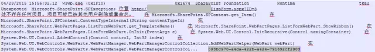
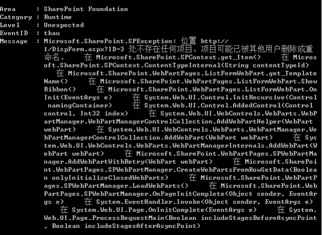
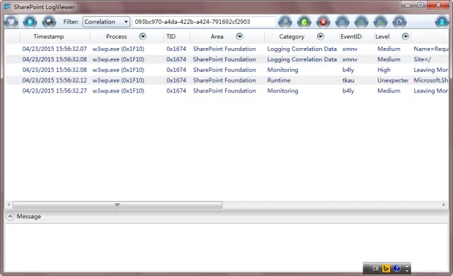
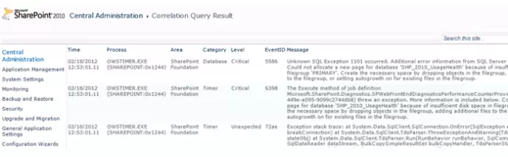

# 如何根据Correlation ID来查找具体的错误信息
	作者：sujingjiang

相信大家在日常使用或者开发SharePoint的过程中或多或少都见过如封面所示的错误提示, 大家这时候可能一头雾水, 不知道是哪里的原因导致的. 下面我们提供几种方法来帮助大家快速定位寻找错误信息:

1. 分析LOGS文件
2. 使用Get-SPLogEvent命令
3. 使用Select语句从SQL数据库中查找
4. 使用第三方工具

## 分析LOGS文件
SharePoint日志文件位于 C:\Program files\Common Files\Microsoft Shared\Web Server Extensions\14\LOGS 文件夹中 (SharePoint 2013是15目录), 大家可以按照日期倒序寻找最新的LOG文件然后使用记事本打开, 根据页面上的ID "093bc970-a4da-422b-a424-791692cf2903" 去搜寻, 很快就会发现问题所在.

## 使用Get-SPLogEvent命令
打开PowerShell, 输入 Get-SPLogEvent | Where-Object {$_.Correlation -eq "093bc970-a4da-422b-a424-791692cf2903"} | select Area, Category, Level, EventID, Message | Format-List 回车, 就可以看到详细的错误提示.

## 使用Select语句从SQL数据库中查找
在开启 Web Analytics Service Application 和 Enable usage data collection 后, SP的日志数据库 (WSS_Logging) 会产生一个名为 ULSTraceLog 的视图, 大家可以直接用 Select 语句进行查询.

## 使用第三方工具
- 客户端程序: SharePoint LogViewer, 详见: https://sharepointlogviewer.codeplex.com/

- 网页版查询工具: SharePoint Query Correlation ID Central Admin Page, 详见: http://spgetcorrelationpage.codeplex.com/

enjoy SharePoint
