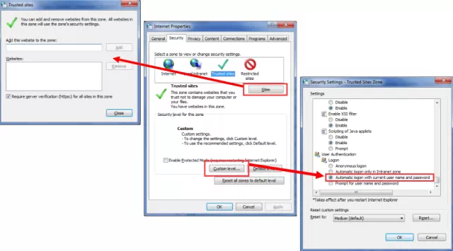
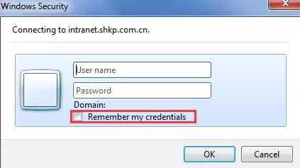
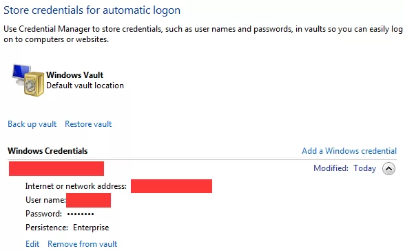

# 如何自动登陆 SharePoint 系统
	作者：sujingjiang

在登陆使用域验证的 SharePoint 环境时, 网页默认会弹出一个 windows 验证的登陆框, 这时候大家需要输入用户名密码等才能登陆.

这时候对于普通用户来说, 他们希望打开 IE 输入网址就能直接登陆进系统, 那我们该如何设置呢? 下面我们分2块为大家说明:

## 对于已经加域的电脑
选择 IE 设置中的 "安全" 选项卡, 将站点加为 "受信任的站点", 其次在该区域的 "自定义级别" 中, 浏览到 "用户身份验证" 勾选 "自动使用当前用户和密码登录", 最后点击 "确定" 完成设置. 这时候大家打开IE输入站点地址就可以直接登陆进系统啦.

## 对于没有加域的客户端
这部分用户在登陆系统的时候都会勾选 "记住我的凭据", 可下次登陆的时候还是会弹出对话框要求输入用户名和密码; 这时候大家会以为是不是出BUG了, 怎么老是会重复多次输入?

其实在勾选 "记住我的凭据" 后, IE 会将当前凭据记录在 "windows 凭据" 中; 具体可以从 "控制面板" -> "凭据管理器" 中进行设置; 其次重复上面对 IE 的设置即加入 "受信任的站点" 和勾选 "自动使用当前用户和密码登录", 这时候就可以直接登陆进系统了.

enjoy SharePoint
