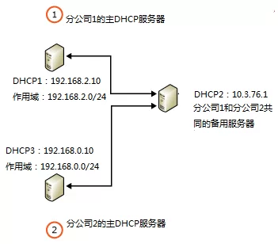
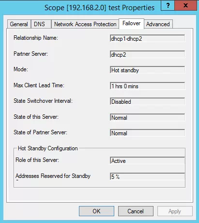
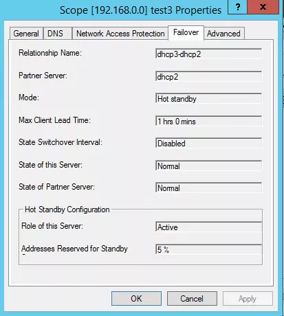

# 如何跨网段配置DHCP故障转移
    作者：小敏

Windows Server 2012 DHCP故障转移是Windows 2012操作系统的一个新功能，当其中一台DHCP故障，另一台DCHP服务器接替此服务器继续工作；由于两台DHCP服务器共享DHCP范围和租赁信息，不会影响引起客户端分配IP地址变化，因此此方案可以提供更好客户体验。配置跨网段DHCP故障转移比较适用于有较多子公司且子公司各自部署有DHCP服务器的集团公司，并且配置热备用服务器模式的DHCP故障转移。此模式下，一般是各子公司的DHCP服务器作为主DHCP服务器，另外在总部部署一台DHCP服务器作为全部子公司的备用DHCP服务器。这样既可实现DHCP高可用功能，又可以满足DHCP就近客户端的原则，还可以节省多台备用DHCP服务器资源（相比较于在各子分公司各自搭建DHCP同网段的故障转移）。如下拓扑所示：

创建的故障转移关系为：
1. 主DHCP1，备DHCP2（dhcp1-dhcp2）

2. 主DHCP3，备DHCP2（dhcp3-dhcp2）

实现跨网段的DHCP故障转移的技术关键点在于主备服务器之间不仅要相互ping通，还需要相互能解析。当主备服务器可以相互ping通，并且可以相互解析时，查看`故障转移`属性，会发现`此服务器状态：正常`，`伙伴服务器的状态：正常`；当主备服务器可以相互ping通，却无法相互解析时，查看`故障转移`属性，会发现`此服务器状态：正常`，`伙伴服务器的状态：不可用`。
当主备服务器均加入域，配置好相关DNS，即可轻松实现相互解析。
当主备服务器均在工作组状态，则可以通过以下两种方式来实现两者的相互解析：
1. 手动添加计算机名的DNS后缀，然后修改hosts记录，使得同网段主备服务器之间可以实现DNS解析。
2. 修改lmhosts.sam记录，实现跨网段主备服务器之间实现NetBios解析，最终达成的效果是ping对方计算机名时可以返回IP值。

