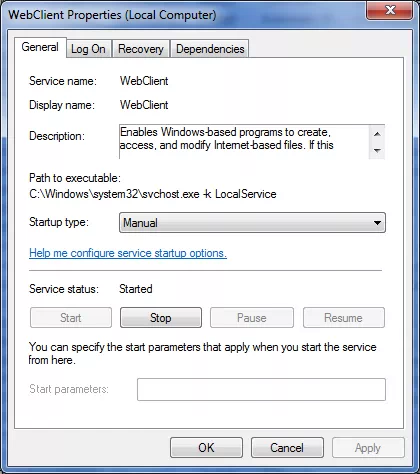

# 无法使用资源管理器浏览文档库？
	作者：sujingjiang

SharePoint UI 界面上创建文件夹, 上传多文件(需 Office 控件支持)等操作我们都可以使用Windows资源管理器来完成, 而且它更加方便快捷, 另外还可以实现一些界面上无法操作的功能, 譬如在相同网站集或网站集之间移动复制文档; 但是有时候我们无法正常使用该功能, 这是为啥呢? 本文从常见的几个设置来帮助大家解决这个问题.      

1. 点击"Windows资源管理器"的时候重复输入用户名密码      
	这个我们只要勾选"记住我的凭据"就可以了.
2. 提示没有"将此网址添加到受信任的站点列表"      
	参考[如何自动登陆SharePoint系统](../20150425/README.md)
3. 检查"WebClient" 服务的状态      
	检查windows服务里面的WebClient服务有没有打开.      
	
4. 最后Windows资源管理器是依靠WebDav来实现的, 大家也可以从这方面来入手.

enjoy SharePoint
