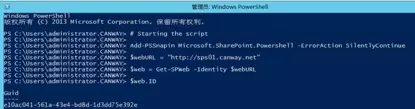
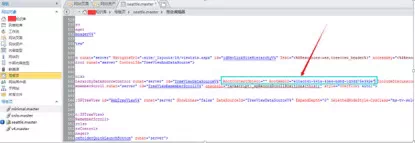

# SharePoint 2013 子网站继承父网站树视图方法
    作者：小敏

在SharePoint 2013中，默认情况下，在SharePoint 2013中“树视图”只会显示当前网站的内容，当从父网站点击连接跳转到子网之后，左侧的树视图即已经发生变更，如下图。这不仅给用户操作造成很大的不便。在具体的项目实践中，较好的方案是使子网树视图也继承父网站的树视图。

### 修改前父网站视图：


### 修改前子网站树视图：


### 修改步骤如下：

1. 使用命令查找网站的GUID

    打开powershell命令行工具，运行以下命令：
    ```powershell
    # Starting the script
    Add-PSSnapin Microsoft.SharePoint.Powershell -ErrorAction SilentlyContinue
    $webURL = "http://sps01.canway.net"
    $web = Get-SPWeb -Identity $webURL
    $web.ID

    ```
    其中，webURL输入的是父网站的URL
    
2.  修改网页的RootContextObject属性

    利用SPD打开子网的母版页，找到RootContextObject的属性，将RootContextObject="Web"更改为RootContextObject=""，并添加RootWebID="e10ac041-561a-43e4-bd8d-1d3dd75e39（该ID即为刚刚使用命令查找到的父网站的网站GUID。然后保存母版页，刷新网页即可。

3. 预览网站页面效果
    
