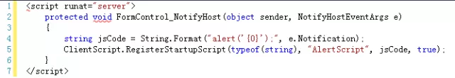

# 怎么在 InfoPath Web 浏览器表单中弹出对话框?
	作者：jingnansu

在启用浏览器兼容模式的InfoPath表单是不能直接使用类似ASP.NET那种方式弹出对话框的, 那么我们是不是就不能弹出对话框了呢? 答案当然不是.

我们都知道XmlFormView控件是SharePoint中承载InfoPath表单页面显示的, 在查阅MSDN后, 我们发现可以为它增加一个"onnotifyhost"方法.      
<InfoPath:XmlFormView id="FormControl" Style="width:100%;" runat="server" onnotifyhost="FormControl_NotifyHost"/>

然后在事件中我们可以用代码注册JS弹出对话框.      

这时候在表单可以调用就很简单了, this.NotifyHost("Msg") 即可.

enjoy SharePoint
