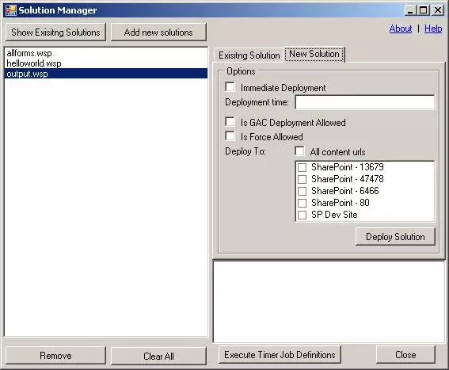
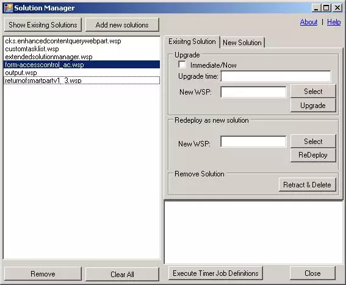

# 使用图形化界面部署WSP解决方案包
	作者：sujingjiang

昨天我们介绍了使用Powershell自动化部署SharePoint解决方案包, 作为SharePoint开发人员, 我们对如何使用PowerShell命令来部署WSP已经很熟悉了:      
+ Add-SPSolution: 向服务器场上载SharePoint解决方案程序包
+ Install-SPSolution: 在服务器场中部署已安装的SharePoint解决方案
+ Update-SPSolution: 更新已部署的SharePoint解决方案
+ Uninstall-SPSolution: 收回已部署的SharePoint解决方案
+ Remove-SPSolution: 从服务器场中删除SharePoint解决方案

那么大家是不是希望有一个图形化的界面来管理操作WSP解决方案包呢?
下面为大家介绍"SharePoint Solutions Manager - WSP Manager", 这款小工具可以帮助大家快速部署升级回收WSP解决方案包。      

下载地址：https://solutionmanager.codeplex.com/#rd

enjoy SharePoint
