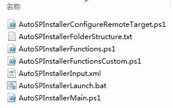

# 使用AutoSPInstaller自动安装部署SharePoint
	作者：sujingjiang

昨天我们介绍了在离线模式下AppFabric安装错误解决办法，那么是不是有什么自动化的工具能帮助我们一次性完成SharePoint的安装呢？当然答案是肯定的。

我们可以利用AutoSPInstaller来实现这一功能，我们只需要将一些配置信息譬如场管理员账号、CA端口号、数据库服务器地址等设置在XML文件中，最后运行PS脚本即可完成全部安装。      

下载地址: https://autospinstaller.codeplex.com/#rd

enjoy SharePoint
