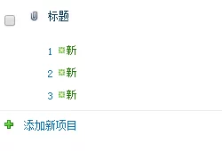
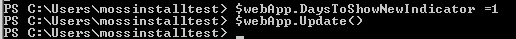
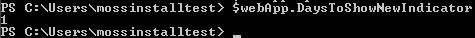

# “新”那么点事
	作者：sujingjiang

我们都知道当创建一个新条目的时候, 标题旁边会自动多一个"新"图标; 过了几天后这个图标就会自动消失, 那么我们能不能自定义这个图标显示的时间呢?


我们首先可以查看一下现在设置的时间, 在PowerShell中输入如下命令:
```powershell
$webApp= Get-SPWebApplication "http://url"
$webApp.DaysToShowNewIndicator
```


如上图, 我们可以发现当前系统中设置显示时间是2天; 然后我们尝试将时间设置成1天, 输入如下命令:
```powershell
$webApp= Get-SPWebApplication "http://url"
$webApp.DaysToShowNewIndicator =1
$webApp.Update()
```



这时候我们再查看一下当前设置的时间, 已经被修改成1天; 1天之后图标就会消失啦.


enjoy SharePoint


