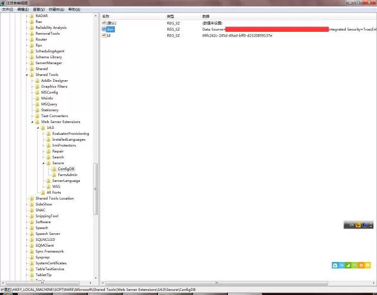

# 如何修改SharePoint服务器数据库连接字符串
	作者：jingnansu

在初始安装SharePoint的时候，大家都输入了一个数据库服务器的地址，这串连接字符串保存在什么地方？可以修改吗？

答案是肯定的。SharePoint服务器将这个连接字符串信息保存在注册表中。路径如下图所示：

在某些情况下，如果需要修改数据库服务器地址或者身份认证方式，账号，可以找到注册表对应的位置进行修改。

enjoy SharePoint
