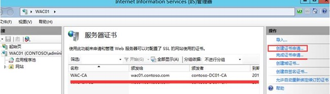
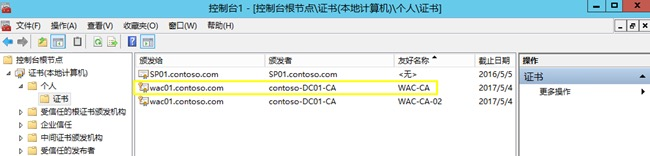
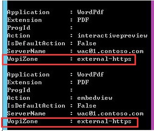

# 使用HTTPS协议集成SharePoint 2013和OWA
    作者：小敏

## 摘要
出于安全考虑，很多公司都会将SharePoint 2013 的浏览器访问配置为HTTPS协议。同时，如果需要在SharePoint场中使用OWA，也需要和OWA进行集成。下面介绍如何使用HTTPS协议配置SharePoint 2013与OWA的集成。

> 关于如何为SharePoint 2013配置HTTPS可以参考博客：http://www.cnblogs.com/jianyus/p/4234780.html

> 注意：*Office Web Apps Server 现在是一款独立的产品，所以不能与SharePoint Server 安装在同一台服务器上，需要分开安装。也可以多台Office Web Apps Server 组成一个服务器场。*

## 配置步骤

1. 准备服务器以运行 Office Web Apps Server
2. Office Web Apps Server 服务器场
```powershell
New-OfficeWebAppsFarm -InternalUrl "https://wac01.contoso.com" -ExternalUrl "https://wac01.contoso.com" -CertificateName "WAC-CA" –EditingEnabled -ClipartEnabled –TranlationEnabled
```
> 参考：https://technet.microsoft.com/zh-cn/library/jj219455.aspx

3. 配置SharePoint 2013 以使用 Office Web Apps
```powershell
New-SPWOPIBinding -ServerName wac01.contoso.com
```
    > 参考：https://technet.microsoft.com/zh-cn/library/ff431687.aspx


> 注意：

    > - 如果SharePoint站点使用HTTP协议，集成OWA需要使用HTTP协议。

    > - 如果SharePoint站点使用HTTPS协议，集成OWA需使用HTTPS协议。

    >   例如：
    ```powershell
    New-OfficeWebAppsFarm -InternalUrl "https://wac01.contoso.com" -ExternalUrl "https://wac01.contoso.com" -CertificateName "WAC-CA" –EditingEnabled -ClipartEnabled –TranlationEnabled
    ```

    >  - 绑定的是证书`名称`
        
    >  - 从MMC打开证书管理器，看到的名称是`友好名称`
        

    > - 配置HTTPS协议集成的时候，在命令`New-SPWOPIBinding -ServerName wac01.contoso.com`中不需要加参数`-allowedhttp`。
    > - 配置成功后，使用`Get-SPWOPIBinding`得到的`WopiZone`属性的值为`external-https`。
      


