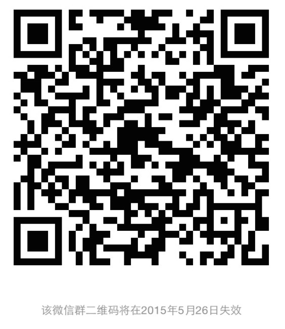

# SharePoint技术聚会
### 时间
2015年5月23日（周六）上午9点30分~12点30分
### 地点
`LE SEVEN乐柒法式咖啡餐厅`上海市虹口区四川北路1363号壹丰广场B2层B21,22(四川北路武进路） 地铁十号线四川北路站

### 费用
- 个人承担到达聚会地点的差旅费用。
- 个人承担咖啡餐厅费用（每位95元，包括场地投影使用，茶点饮料及午餐）。

### 主题
- Infopath与SharePoint工作流
- 浅谈SharePoint身份验证及应用
- 使用VS开发SharePoint网站页面
- 其他与SharePoint相关的开放话题

### 过程安排
- 9:30 ~ 10:00 签到，自我介绍
- 10:00 ~ 10:30 使用VS开发SharePoint网站页面
- 10:30 ~ 11:00 浅谈SharePoint身份验证及应用
- 11:30 ~ 12:00 Infopath与SharePoint工作流
- 12:00 ~ 13:00 午餐及自由交流

### 参加方式

扫描下方二维码加入微信群，并提供联系方式，以备不时之需。

