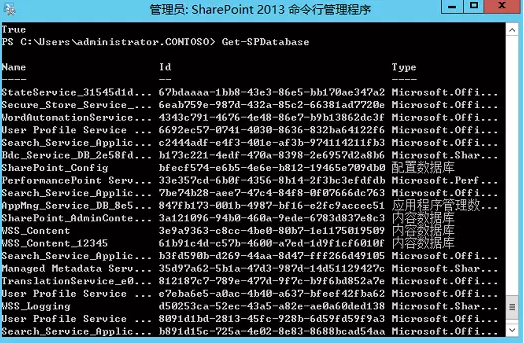

# SharePoint迁移之配置数据库连接
	作者：小敏

迁移SharePoint数据库的方法有很多种, 那么在迁移后我们如何修改数据连接呢? 今天我们就来简单聊一聊:

1 如果迁移前后的数据库服务器实例相同, 譬如原来是SQLCLU01\SL01, 迁移后是SQLCLU02\SL01; 只需把DNS中旧的数据库服务器所对应的IP指向到新数据库服务器即可.     
2 如果迁移前后的数据库服务器实例不相同
> - 我们打开PowerShell命令行提示符, 使用Get-SPDatabase命令列出所有数据库信息.
> - 然后我们获取需要修改的数据库的对象     
> 
> $db = Get-SPDatabase -identity 9ff395b3-c804-4b8b-8bbb-0dc2d8c39e70 (这是要迁移的数据库的ID)     
> 然后我们修改此数据库的连接配置     
> $db.ChangeDatabaseInstance("SQLCLU02.CONTOSO.COM\SL01") (这是要指向新的群集实例名称)     
> $db.Update()      
> 如此重复多次即可     

3 使用数据库别名的方法来指向SharePoint的数据库连接, 具体可以参考下方的"阅读原文".