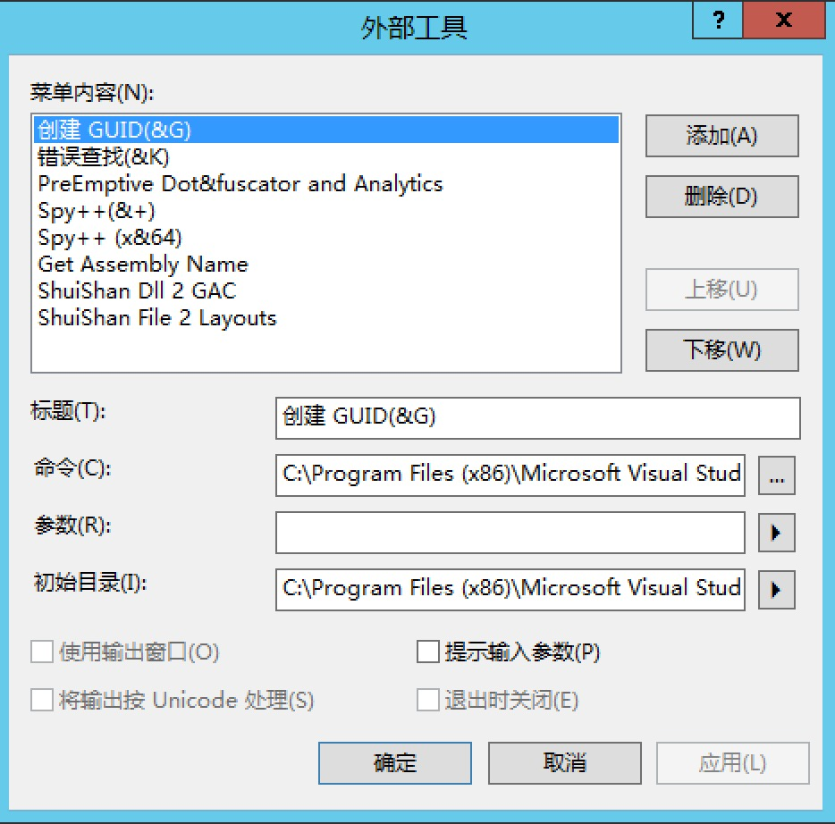
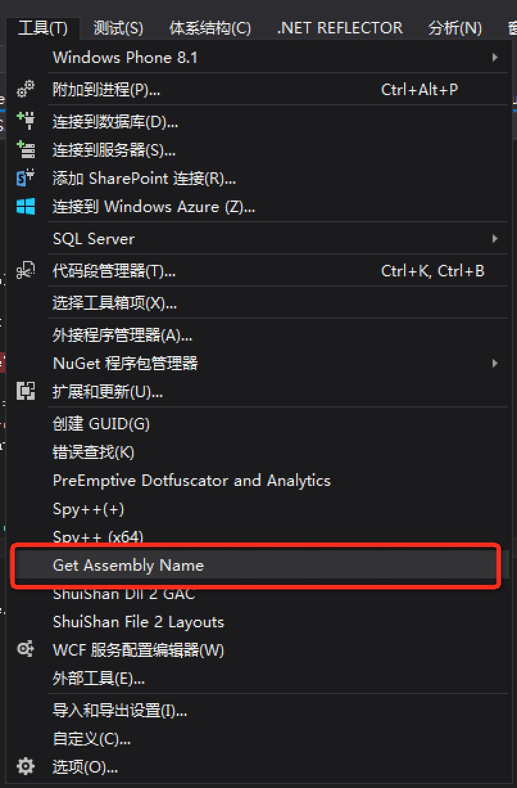
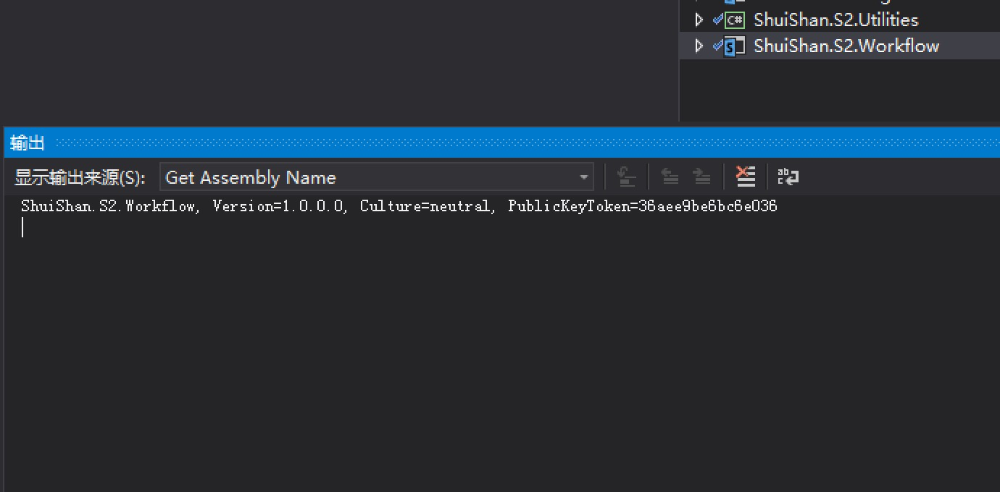

# 灵活运用VS外部工具：获取程序集全名称
    作者：杨柳@水杉网络

## 摘要
Visual Studio是一个超级强大的开发集成环境，在日常开发过程中我们可能只发挥了它30%的功力。除了日常的代码编写，编译，发布，还有众多的功能帮助我们提升开发效率，`外部工具`就是其中之一。

在开发过程中，我们偶尔需要使用程序集的全名称，情急之下还不知道从什么地方获取最快捷，此篇就介绍一下借助`外部工具`获取Visual Studio中当前项目程序集的全名称。

## 过程
1. 选择Visual Studio的：菜单->工具->外部工具，显示如下截图：

2. 点击`添加`按钮，内容分别输入：
    * 标题：Get Assembly Name
    * 命令：C:\Windows\System32\WindowsPowerShell\v1.0\powershell.exe
    * 参数："[System.Reflection.AssemblyName]::GetAssemblyName(\"$(TargetPath)\").FullName"
    * 选中`使用输出窗口`

3. 点击`确定按钮`，再次点击 菜单->工具，显示如下截图：

## 使用
在一个有Dll输出的项目上，点击 菜单->工具->Get Assembly Name，在Visual Studio集成环境的输出窗口中，就可以看到项目相程序集的全名称。如下图：

