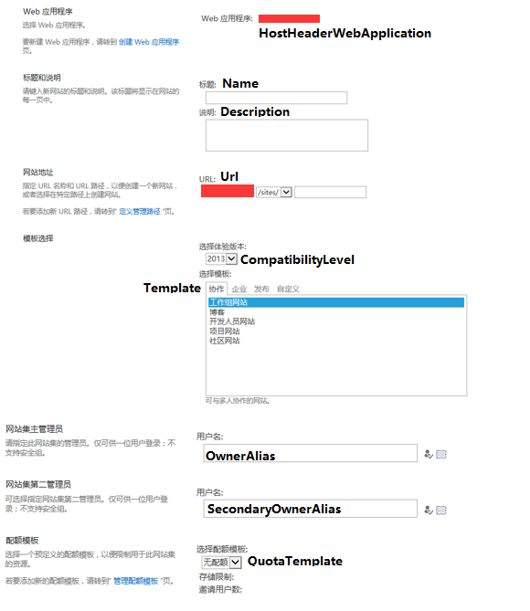

# New-SPSite
	作者：sujingjiang

这个命令简单的说就是创建新的网站集.

## 例子     
`New-SPSite http://<site name> -OwnerAlias "DOMAIN\username"`

## 参数
> - "Name": 指定新网站集的标题.
> - "Description": 指定新网站集的描述说明.
> - "Url": 指定新网站集所使用的地址.
> - "HostHeaderWebApplication": 承载新网站集的Web应用程序名称、URL、GUID或SPWebApplication对象.
> - "OwnerAlias": 指定新网站集所有者的用户登录名, 格式为"Domain\username".
> - "SecondaryOwnerAlias": 指定新网站第二所有者的用户登录名.
> - "CompatibilityLevel": 设置新网站集的体验版本, 值可为14(SharePoint 2010的体验网站)或15(SharePoint 2013的体验网站).
> - "ContentDatabase": 指定要承载新网站集的内容数据库名称或GUID, 如果未指定那么将自动选择.
> - "Language": 指定新网站集的语言ID.
> - "QuotaTemplate": 指定新网站集的配额模板.
> - "Template": 指定新网站集根网站的网站模板.

## 具体如下图所示

enjoy SharePoint
