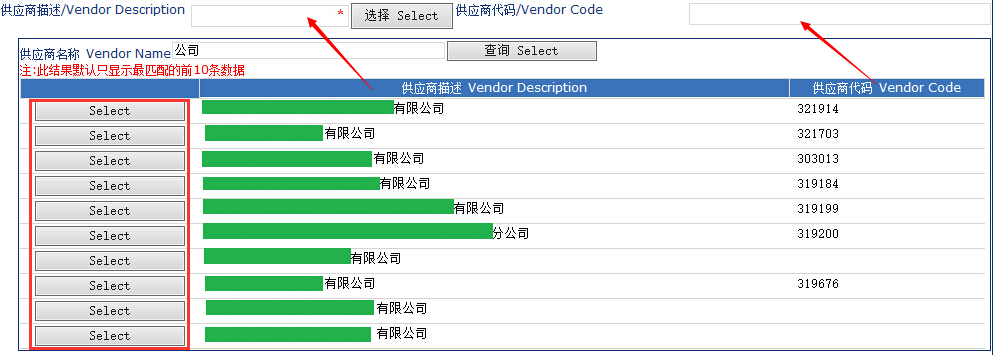
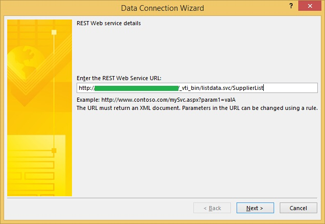
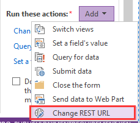
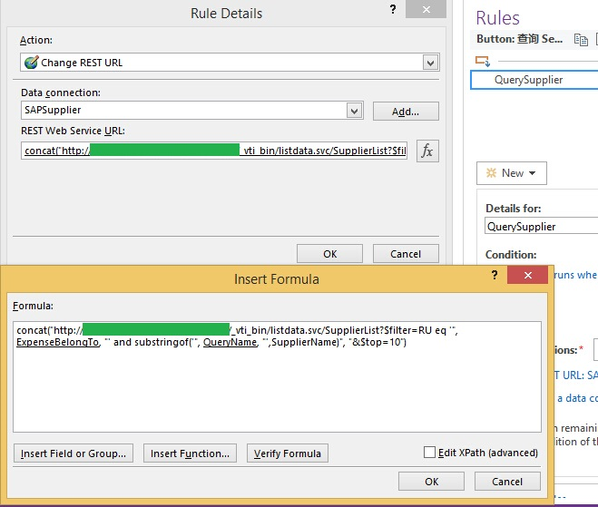

# 无码制作一个InfoPath LOV
    作者：柒月

## 摘要
LOV（List of values，值列表）在表单中起到了很关键的作用，它能极大地减少用户录入信息的错误率，以及缩短表单的填写时间。

什么是LOV？你可以认为它是一个查询控件，在Oracle EBS里经常被叫做LOV。举个简单的例子——SharePoint2010中的PeoplePicker，这个控件需要用户输入一个账号名，`检查名称`成功后表示录入成功。若用户想选择某一个SPUser，但是不记得这个SPUser的完整的登录账号。在这里，可以使用PeoplePicker的`浏览`功能，通过输入**部分**显示名或邮箱信息，模糊筛选到一批账号信息，从中选择需要的SPUser，就完成了人员的选择。

然而，PeoplePicker并不好用，因为它响应太慢了。在下面的例子里，我们尝试着在InfoPath中制作另一个并不好用的LOV（也是慢）。

如图，我正做一个操作————以`公司`为关键词点击`查询`进行模糊查询，找到10条信息，点击左边的`选择`按钮，将会把`供应商描述`和`供应商代码`一并带出并赋值给最上面的两个文本框。

## 过程

刚开始做时，遇到一个尴尬的问题。供应商信息保存在一个SPList里，`RepeatTable控件`可以绑定这个`SPList数据源`，但是要对数据源进行筛选，只能通过给QueryFields赋值的方式，这样就意味着模糊筛选行不通，只好想办法绕路了。

SPList提供了以REST方式读取数据的API。在InfoPath中，数据源以选择SPList提供的REST Web Service。配置好数据源后，将`RepeatTable控件`绑定到这个REST数据源

当表单中配置过REST数据源后，查询按钮的Action会神奇地多了一条Change REST URL

我只要在点击查询按钮时，根据[REST API](https://msdn.microsoft.com/en-us/library/fp142385 "REST API")重新拼接出一条带模糊筛选（$filter、substringof()）、分页（$top、$skip）、排序（$orderby）的URL，再对这个URL进行Query操作，那么RepeatTable就将筛选后的数据展现了出来。

