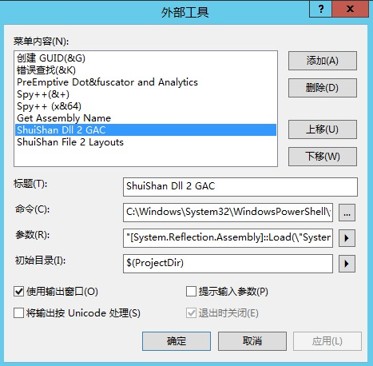
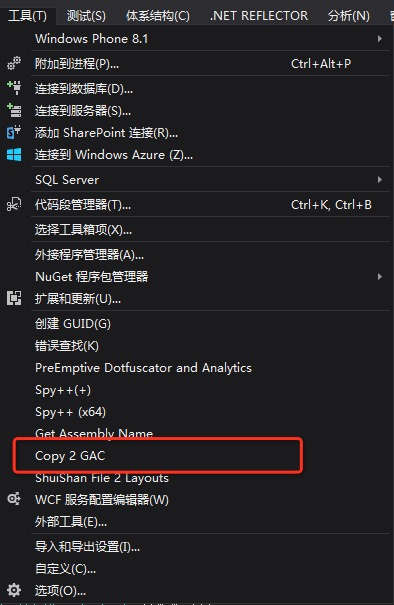
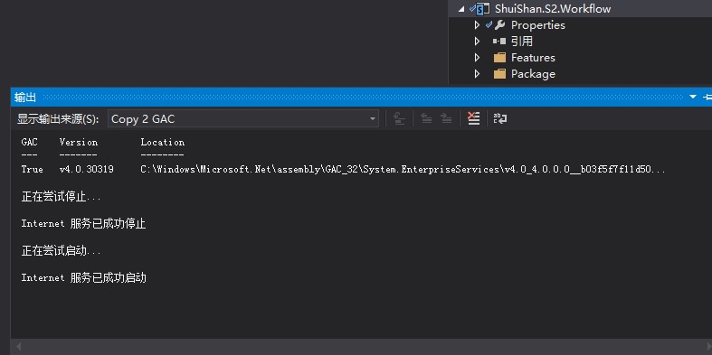

# 灵活运用VS外部工具：Copy assembly to GAC
    作者：杨柳@水杉网络

## 摘要
Visual Studio是一个超级强大的开发集成环境，在日常开发过程中我们可能只发挥了它30%的功力。除了日常的代码编写，编译，发布，还有众多的功能帮助我们提升开发效率，`外部工具`就是其中之一。

在SharePoint开发过程中，如果按照标准的场解决方案开发模式，有任何的改动，比如修改了css，js，动了C#代码，修改了aspx页面文件，调整了Feature，我们都需要部署整个解决方案项目。部署过程是按照解决方案回收，删除，添加，部署，激活这个过程进行，如果场解决方案内容较多，那么这是一个漫长的过程。有没有办法节省时间提升效率呢？此篇介绍其中特定的一种情况：只是解决方案包包含的程序集发生了变化。同样，我们可以借助`外部工具`复制程序集到GAC。

## 过程
1. 选择Visual Studio的：菜单->工具->外部工具，显示如下截图：

2. 点击`添加`按钮，内容分别输入：
    * 标题：Copy 2 GAC
    * 命令：C:\Windows\System32\WindowsPowerShell\v1.0\powershell.exe
    * 参数："[System.Reflection.Assembly]::Load(\"System.EnterpriseServices, Version=4.0.0.0, Culture=neutral, PublicKeyToken=b03f5f7f11d50a3a\");$publish = New-Object System.EnterpriseServices.Internal.Publish;$publish.GacInstall(\"$(TargetPath)\")"; iisreset;
    * 选中`使用输出窗口`

3. 点击`确定按钮`，再次点击 菜单->工具，显示如下截图：

## 使用
在一个有Dll输出的项目上，点击 菜单->工具->Copy 2 GAC，在Visual Studio集成环境的输出窗口中，我们会发现在Copy to GAC后，顺带重启了iis。如下图：

