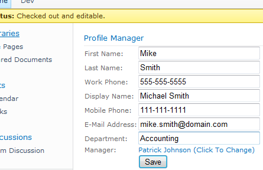
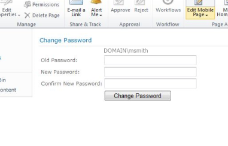

# Active Directory Tools For SharePoint
    作者：jingnansu

小伙伴们在项目中会不会遇到用户或者客户希望在SharePoint上直接修改AD域中的信息或者密码呢? 当然从开发角度来说不是很复杂, 但是当"懒"发作的时候, 我们就想去看看有没有现成的解决方案啦. PS: 这块工具很多, 仅举例~. 

下面为大家介绍"[Active Directory Tools For SharePoint](https://adselfservice.codeplex.com/ "Active Directory Tools For SharePoint")", 老外的东西就是界面比较"简洁", 大家可以点击链接看看.

     

enjoy SharePoint