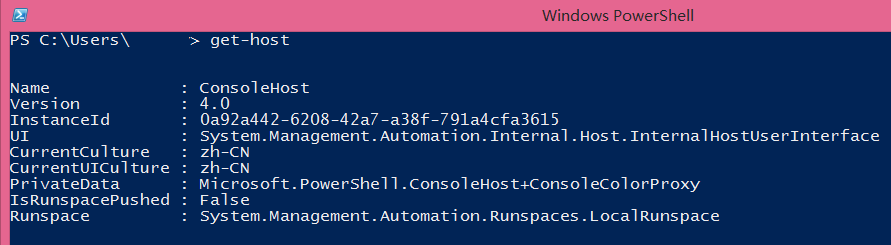

# PowerShell介绍 第一回 "Shell Everything"
    作者：小敏

PowerShell从2006年1.0发布到现在已经翻过8个年头, 大微软离"Shell一切"的终点线越来越接近. 我们不禁要问相比传统CMD命令提示符, PowerShell究竟有哪些高级的地方？ 我们可以从下面几点来"一窥全Shell":

1. 语法简洁明了(动词-名词)
2. 新旧通吃(.NET Framework+WSH)
3. 面向对象
4. 可扩展编程
5. 微软全平台产品支持

我们可以看出微软希望PowerShell犹如其名: Power Shell, Shell Everything.

在下面的推文中我们将陆续向大家介绍PowerShell的一些基本语法, 希望大家喜欢~

当然工欲善其事, 必先利其器. 由于我们下面的介绍都将基于最新版的PowerShell, 大家可以使用"get-host"来查看当前PowerShell所使用的版本是否最新.

Windows 7或者Windows Server 2008: 已经内置PowerShell 2.0, 可以升级为3.0或者4.0.

Windows 8或者Windows Server 2012: 已经内置PowerShell 3.0, 可以升级为4.0.

Windows 8.8或者Windows Server 2012 R2: 已经内置PowerShell 4.0.

各个版本的下载链接如下:     

[PowerShell 1.0](http://www.microsoft.com/zh-cn/download/details.aspx?id=9591 "PowerShell 1.0")

[PowerShell 2.0](http://www.microsoft.com/zh-CN/download/details.aspx?id=9864 "PowerShell 2.0")

[PowerShell 3.0](http://www.microsoft.com/en-us/download/details.aspx?id=34595 "PowerShell 3.0")

[PowerShell 4.0](http://www.microsoft.com/zh-CN/download/details.aspx?id=40855 "PowerShell 4.0")
