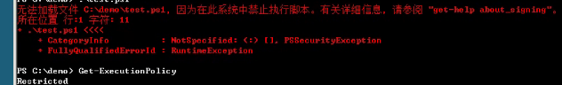
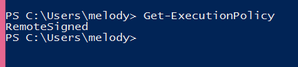
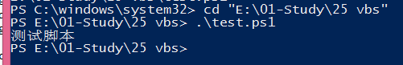

# PowerShell介绍 第二回 "PowerShell执行策略"
    作者：小敏

是不是遇到过以下情况？执行策略的时候被禁止了：

所以可以通过以下策略来查看当前的执行策略：Get-ExecutionPolicy

默认设置为最安全的策略“Restricted”。该设置允许运行单个命令，但不允许运行脚本。我的测试环境的测试是RemoteSigned

说明：如果该命令执行失败，则可能是由于拼错了策略名称。请检查该名称，然后重试。按Tab键自动补齐则会减少出错的概率；假如没拼错但是还是无法执行，就是权限不够，请以管理员身份运行或者联系你的管理员。
 
那么此时需要使用Set-ExecutionPolicy来更改执行策略，可设置的参数值如下：

1. Restricted——默认的设置， 不允许任何script运行
2. AllSigned——只能运行经过数字证书签名的script
3. RemoteSigned——运行本地的script不需要数字签名，但是运行从网络上下载的script就必须要有数字签名
4. Unrestricted——允许所有的script运行

当执行策略为RemoteSigned，PowerShell 将不会运行从Internet（包括电子邮件和即时消息程序）下载的未签名脚本若要运行未签名脚本，请执行以下操作：

    1. 将脚本文件保存在计算机中。
    2. 依次单击“开始”、“我的电脑”，然后导航到保存的脚本文件。
    3. 右键单击该脚本文件，然后单击“属性”。
    4. 单击“取消阻止”。
当执行策略为AllSigned时，需要经过数字证书签名才可以运行，那么怎样才可以给脚本添加证书签名使之可以运行呢？
可以使用以下命令来对脚本进行签名

可以使用Get-Help Set-AuthenticodeSignature来查看该命令用法。
最后，在提一点就是经常有人遇到运行脚本报错，策略也检查了没问题，双击也打不开，权限也够了，郁闷半天，原来是打开方式不对。首先需要进入到脚本所在目录，然后使用.\来运行，如下图：

好了，今天的介绍就先到这里了。我们下次再见。

