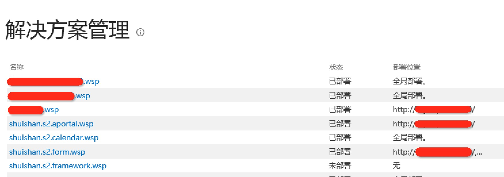
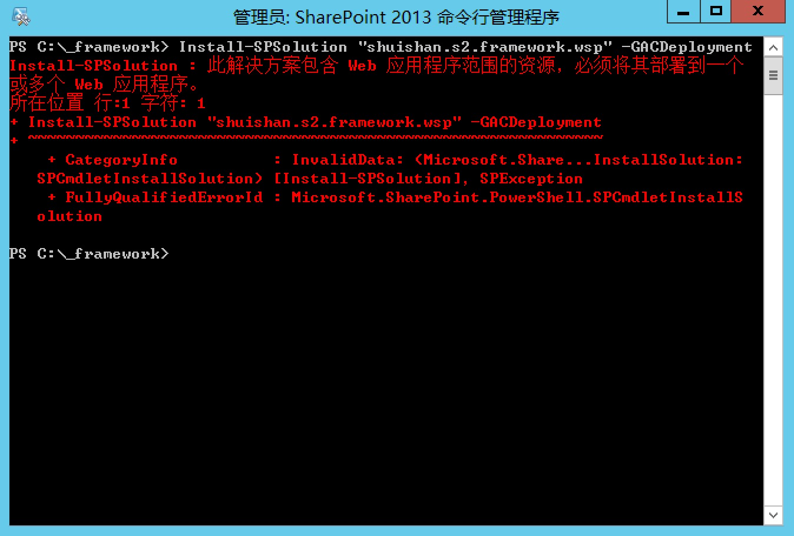
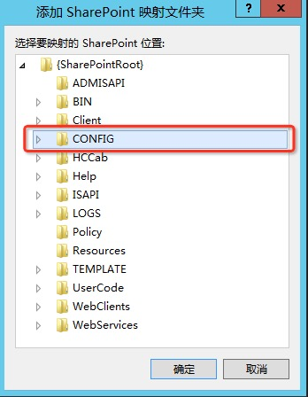

# 浅析场解决方案部署位置
    作者：杨柳@水杉网络

## 困扰吗？
在SharePoint自定义开发的各种方式中，场解决方案开发方式具有举足轻重的地位，其中重要的一点是因为场解决方案可以使用场提供的所有资源。如果在开发环境中直接使用VS部署解决方案包，部署完成后到管理中心中查看解决方案包，会发现解决方案包的部署位置可能不同：


如果我们使用Powershell部署解决方案包，针对不同的解决方案包，同样的命令不一定都能成功部署：



在这里，我们会得到一个明确的反馈：`此解决方案包包含Web应用程序范围的资源，必须将其部署到一个或多个Web应用程序`。那究竟什么样的资源属于Web应用程序范围的资源？下面我们来一探究竟。

## 起初，有了代码...
既然不同的的解决方案包可能有不同的部署位置模式，那么猜想，解决方案包对象模型上获取有这种差异的表现。于是去翻一翻SPSolution对象的代码，运气不错，果然有这样的描述：
``` c#
public bool ContainsWebApplicationResource
{
    get
    {
        return this.m_HasWebAppResource;
    }
}
```

虽然描述很简洁，总算找到了差异所在，继续往下探索，最终从SPSolutionPackage对象中找到了我们想要的内容，代码冗长，不在这里累述，总结一下需要部署到Web应用程序的解决方案包的特点：
* 解决方案包中有程序集部署目标为WebApplication
* 解决方案包包含SafeControl定义
* 解决方案包种包含ApplicationResourceFile或者App_GlobalResourceFile
* 解决方案包包含WebPart的推送
* 解决方案包包含BindingRedirect定义：用于版本升级时程序集版本号的自动切换。
* 解决方案包包含CodeAccessSecurity定义。

恩，一不小心清理出这么多种情况，但仔细看看，还是能发现一些规律，以上这六种情况可以归类到两种情况下：
1. 对WebApplication下的web.config改变：定义SafeControl，定义BindingRedirect，CodeAccessSecurity都属于这个范畴。
2. 推送文件到WebApplication下，比如程序集部署到WebApplication，推送App_GlobalResourceFile

所以我们只要把握这两种大的情况，如果开发的场解决方案包包含 这样的情况，在使用powershell命令部署的适合注意使用`-AllWebApplications`或 `-WebApplication`参数，当然忘记了也问题不大，他会给你异常提示。

## 结尾
一般说来结尾是保证文章三段式的手法，多数时候无关大雅，但今天，有重要的东西呈现：

SharePoint从2010开始提供一种机制，叫做`Supplemental .config File`，通俗讲就是允许我们定义一个xml格式的web.config文件片段，在部署解决方案包的时候SharePoint会根据这个文件的定义自动修改web.config的内容，这个文件在存在SharePoint映射文件夹下的Config目录中：


所以一个解决方案包中包含对web.config的补充文件，那么也属于之前介绍的修改web.config范畴，也需要指定WebApplication进行部署解决方案包。

到这里，真的结束了。
