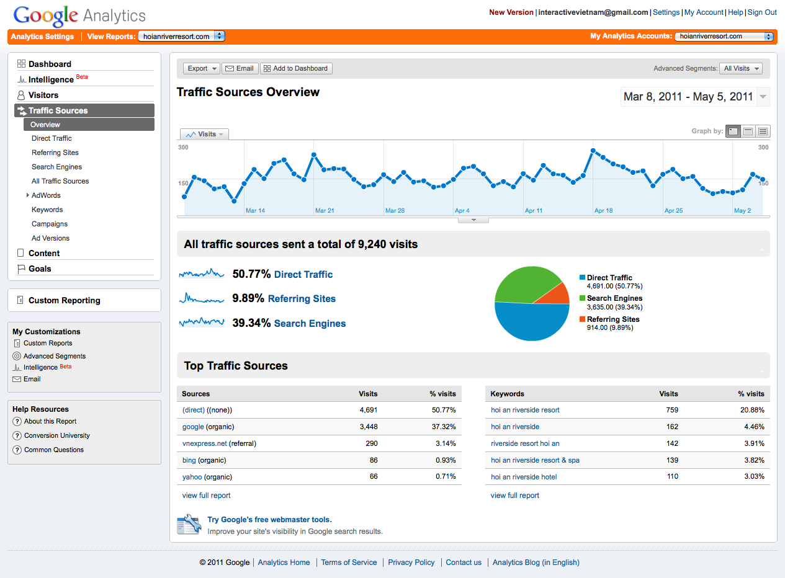

# Google Analytics For SharePoint
    作者：jingnansu

虽然SharePoint已经内置一些报表可以显示当前页面流量和活跃用户等信息, 但是显示的信息比较少, 而且也没有图表直观显示. 

百度和Google Analytics等都是站长常用的流量统计分析工具, 我们是不是可以将其他跟SharePoint结合起来呢?

"[Google Analytics SharePoint 2013/Office 365](https://googleanalytics365.codeplex.com/ "Google Analytics SharePoint 2013/Office 365")"这个解决方案可以帮助大家将Google Analytics嵌入到SharePoint中, 并且也支持Office 365. 大家可以点击上面的链接查看具体内容.

enjoy SharePoint
