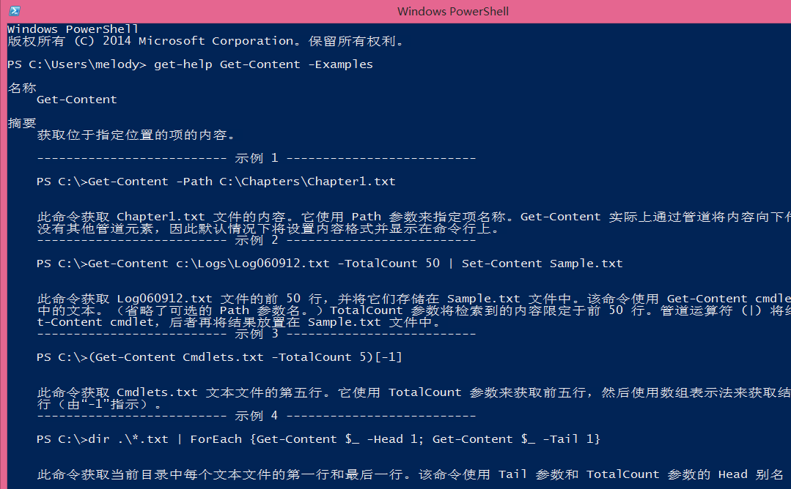

# PowerShell介绍 第三回 "PowerShell导入导出"
    作者：小敏

`1.` 使用get-command "* import *"查找出和导入相关的命令，从结果看到只有Import-Clixml和Import-CSV两个命令，难道就只有这两个命令可以“导入”内容吗？

当然不是啦，除了Import-Clixml和Import-CSV，还可以使用get-content来将需要导入的内容进行导入。例如你要获取N台计算机的系统信息，这N台计算机名称可以写在txt的列表里面，然后使用get-content来导入。

关于这三个命令如何使用，请结合get-help xxx -examples的命令来查看学习即可，如下截图。

`2. `那么导出呢？3.	同样使用get-command "*export*"查找和导出相关的命令，也只发现Export-Clixml和Export-CSV两个命令,此时你是想知道如果导出html怎么办对吧？此时你则可以使用ConvertTo-Html来将结果导出为html，使用ConvertTo-CSV将结果导出为CSV。关于这四个命令的用户依旧请使用get-help xxx -examples来学习。

例子，关于export-CSV的使用，可以感受一下以下两条命令的效果：

Get-process | export-csv -path e:\processes.csv –NoTypeInformation

Get-process | select-object ProcessName,VM,CPU | export-csv -path e:\processes2.csv –NoTypeInformation

你会发现processes.CSV里面收集到的结果比直接运行get-process显示在屏幕的结果要多很多。

`3. `接下来还想要介绍的是另外一个导出的命令out-file。实out-file就是>，out-file -append就是和>>效果一样，前面一个事覆盖，后面一个是附加。

例子，

$i=0 

$Type = "Win32" 

$WMI = Get-WmiObject -List | Where-Object {$_.name -Match $Type}

Foreach ($Class in $WMI) {$Class.name; $i++}

如果想要将结果导出到CSV怎么办呢？可以有以下几种方法：

1)	Foreach ($Class in $WMI) {$Class.name >> c:\1.csv; $i++}
但是，$Class.name; $i++>>D:\2.txt;
以及{"$Class.name" ; $i++}>>D:\2.txt结果都是不一样的，而且是不对的，可以自行测试感受一下效果

2)	Foreach ($Class in $WMI) {$Class.name | out-file –filepath e:\win32.csv -append; $i++}
接-append和不接-append的效果又是不一样的，也可以自行测试感受下效果

3)	但是呢在这里如果用export-csv来导出，出来的不知道是什么鬼
{$Class.name | export-CSV -path e:\3.csv -NoTypeInformation; $i++}
据说是要先定义一个变量来替换，很复杂的说，有兴趣的童鞋可以自行研究

好了，今天的介绍就先到这里了。我们下次再见。
