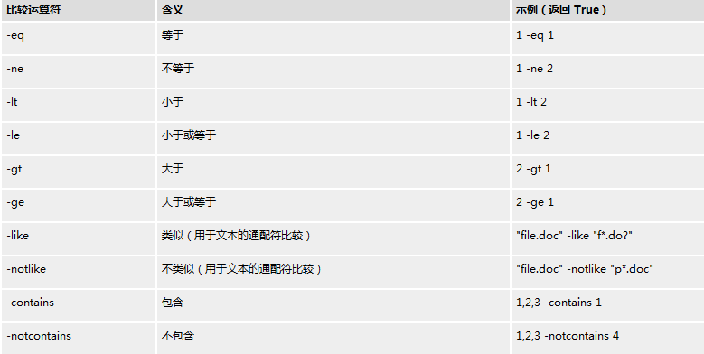
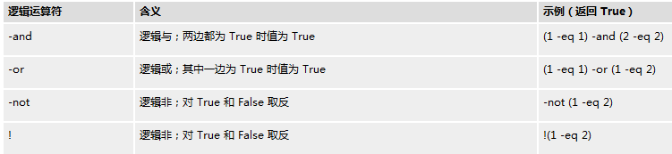
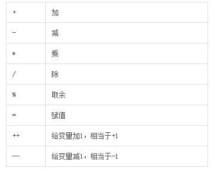

# PowerShell介绍 第四回 比较符、逻辑符和运算符
    作者：小敏

本小章节来介绍PowerShell的“符号”那些事，主要是比较符、逻辑符和运算符。

## 比较符

常见的比较符如下表，其中-eq用的比较多。而且还有个特点就是比较符经常会和where-object在一起使用，请看以下例子。
>1. Get-Service | Where-Object {$_.Status -eq "Running"}

## 逻辑符

常见的比较符如下表，逻辑符常用于条件判断中，常用的有or和and，请看下面例子。
>1.$acl = (Get-Acl $folder.fullname).access | where {($_.IsInherited -eq "false") -and ($_.IdentityReference -ne "NT AUTHORITY\SYSTEM")}

## 数学运算符

常见的的数学运算符如下表，数学运算符在PowerShell的脚本用得不太多，常见的有++，仅做个了解就可以了。如果想详细了解运算符可以在PowerShell上输入 get-help about_Operators.

好了，今天的介绍就先到这里了。我们下次再见。
