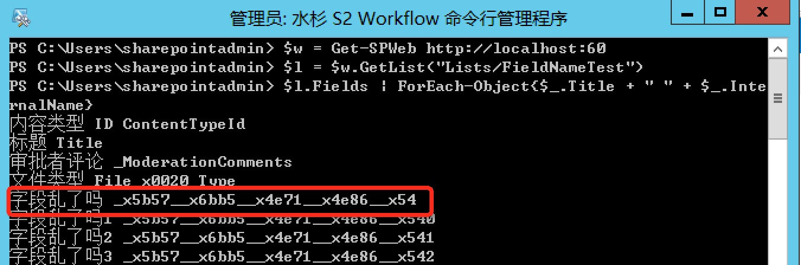
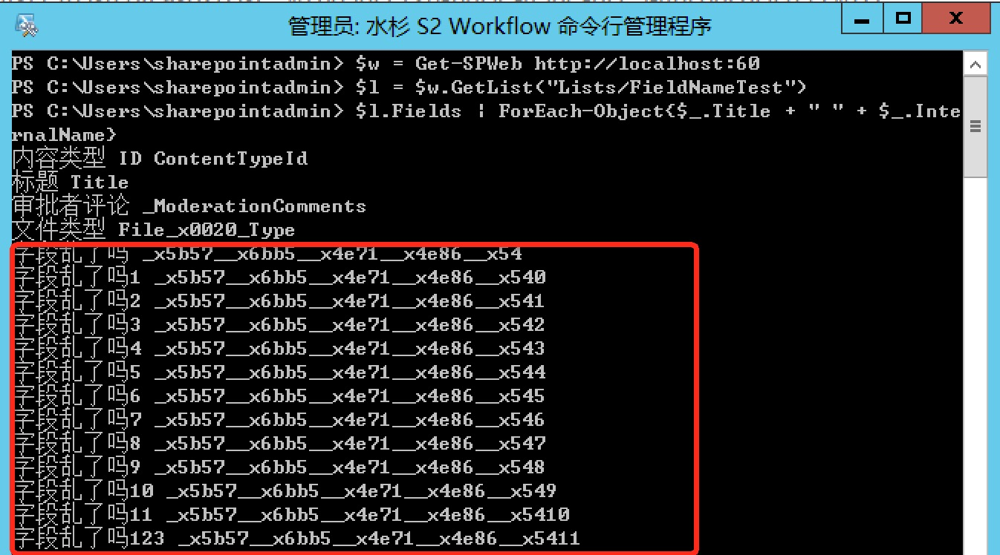
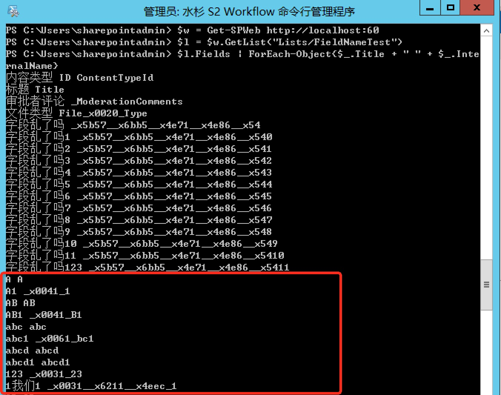

# SPField.InternalName命名规则探索
    作者：杨柳@水杉网络

## 关于InternalName
前面发过一篇文章，叫做[浅析SPField的DisplayName，InternalName，StaticName](https://github.com/iiunknown/sharepoint.ramble.wechat/blob/master/20150429/README.md)，其中介绍了三者的定义及使用。在开发过程中，使用得比较多的是InternalName。我们都知道，InternalName在一个列表中会保证唯一性，下面是MSDN中对InternalName的说明：

    字段的内部名称。该名称在列表或网站的字段集中必须为唯一。如有必要，SharePoint Foundation 会修改该值以保证其唯一性；且在字段定义的生命周期内，其不会更改。

上面的描述向我们表达了三个意思：
1. 字段集合中InternalName唯一。
2. SharePoint为了保证第一点，有权修改你的定义。
3. 一旦生成，不会被修改。

其中`SharePoint保证InternalName唯一性`充满了神秘感，找了官方非官方的各种说明，基本只说明了下面两种情况：
1. InternalName最长32个字符（ASCII字符）。
2. 非ASCII码会被转义，使用`System.Xml.XmlConvert.EncodeName`的模式进行转义。

真的就上面两个规则怎么简单么？经过实践，发现一切并非如此。

## 实践出真知

`System.Xml.XmlConvert.EncodeName`使用UTF8进行Encode，按照此规则，一个汉字会被转化为7位ASCII码，比如`字`字会被转化为`_x5b57_`，因此，我们先来测试一下关于`32个字符`的传说。

创建一个测试列表`FieldNameTest`，然后新建字段`字段乱了吗`。按照规则，5个汉字，转化为ASCII码长度为35，按照`32个字符`的规则，SharePoint如何工作的呢？如下图，原来SharePoint先做转换，然后按照32位进行截断。

用5个中文字符定义字段名称，就会被截断了，那前面五个中文字符一样，后面还有其他不同字符，SharePoint会如何处理呢？继续实践，创建多个以`字段乱了吗`开头的字段，结果发现，SharePoint会在32位字符之后添加自己的索引来满足唯一性的要求，所以，这种情况下字段的InternalName并不是32位了，后面还有索引的长度。当然，位数不是特别重要，重要的是如果你使用InternalName去获取SPField实例，需要特别注意这样的情况。

## 意外发现
上面一直围绕着SPField.InternalName的最大长度描述，对于最小长度有没有什么需要注意的地方？从官方资源目前没有看到这样的描述，这会有什么问题么？会有，否则就不会叫`意外发现`。如果你使用一到三个任意字符作为字段名称开始，后面跟上数字，第一个字母会被使用UTF8进行转义：

如上图，如果你定义一个字段叫做`A`，那么InternalName还是`
A`， 定义一个字段叫做`A1`，InternalName则会被转义为`_x0041_1`。这是实践的结果，对于SharePoint为什么对下限也有如此做法还没有想明白。

到这里，各位看官会说：恩，知道了，使用InternalName获取SPField实例的时候我会注意的。再次搬出`意外发现`这个台词。

注意，下面内容不是演习，下面内容是实际发生：
如果使用Schema去定义列表模板，定义列表实例，使用Feature放到解决方案包中去推送，且字段名称包含上面描述的规则：`三位字符及以内+数字`，则激活Feature的时候一定会报错导致整个Feature激活不成功，进而导致整个解决方案包部署不成功。所以，需要谨慎定义你的字段名称。

##总结
综上所述，InternalName的命名规则在目前（为什么要说在目前呢 ？因为没有找到官方说法）按照如下规则进行：
1. 先编码：非ASCII字符会使用UTF8进行编码，编码后长度为7位。
2. 编码潜规则：满足正则规则（\w{1, 3}\d+）的命名第一个字符会进行UTF8编码。
3. 按照32位进行截取。
4. 截取后如果有重复，在32位之后添加自增长索引。
