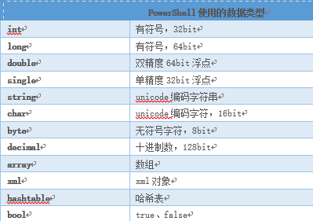
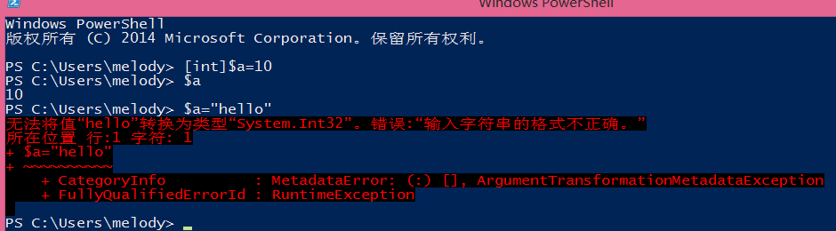
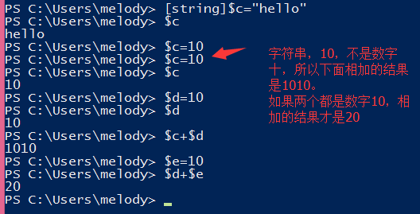
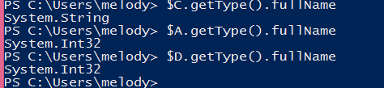
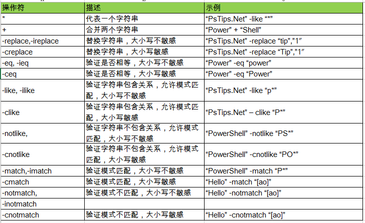
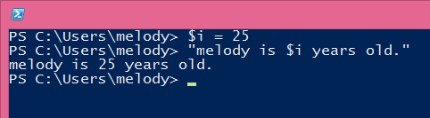
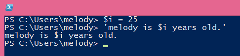
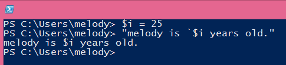
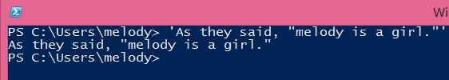

# PowerShell介绍 第五回 字符串及其操作符
    作者：小敏

本小章节来介绍PowerShell的“字符”那些事，主要是字符串类型及其操作符。

## 字符串类型

常见的PowerShell的常用数据类型说明如下：

常用的字符类型有int和string，下面举几个例子进行说明

1. 已经定义为int类型的，不可以再赋予string类型的值

2. 定义string类型

说明：可以使用以下命令来查看当前字符类型

## 字符串操作类型

常见的字符串操作符如下截图。

最后补充一下在powershell中单双引号字符串的区别：

>双引号：将字符串括在双引号中时，则在将字符串传递给命令进行处理之前，以美元符号 ($) 开头的变量名称将被替换为变量的值。
>

>将字符串括在单引号中时，该字符串将按键入时的原样传递给命令，不执行任何替换。
>

>要防止在双引号字符串中换入变量值，可使用倒引号字符 (`)，该字符为 Windows PowerShell 转义字符。
>

>要显示字符串中的双引号，请将整个字符串括在单引号中;当然也可以将单引号字符串放入双引号字符串中
>

好了，今天的介绍就先到这里了，要想了解更多的关于Quoting的规则，可以输入get-help about_quoting_rules来查看帮助。我们下次再见。
