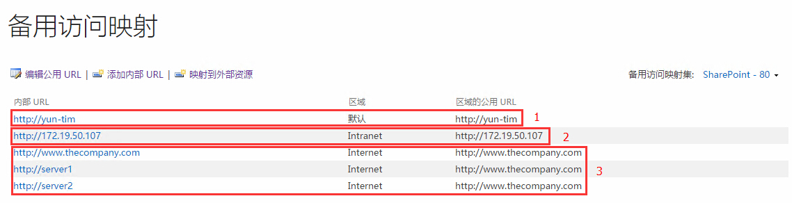

#SharePoint备用访问映射
	作者：柒月
当客户端与SharePoint网站交互时，备用访问映射（Alternate Access Mappings，简称AAM）起到了很关键的作用。首先，他告诉SharePoint，客户端访问的是哪个Web应用程序，随后它将正确的内容，正确的URL反馈给了客户端。

##如何理解备用访问映射
如图，这里展示了名为`SharePoint-80`的Web应用程序的访问映射表：

那么，向SharePoint请求资源时发生了什么？

1. 它首先会根据请求的URL找到对应的Web应用程序。例如：我们使用http://yum-tim/xxxxx 或者http://172.19.50.17/xxxxx 访问，SharePoint会查找上图的`内部URL`，知道客户端请求的是`SharePoint-80`这个Web应用程序。但是，如果我们没有配置上图中的第二个红框，即使使用了正确的IP地址，SharePoint也会提示错误信息：`找不到位于 http://172.19.50.107 的 Web 应用程序。请确认正确键入了此 URL。如果此 URL 需要提供现有内容，则系统管理员可能需要添加到指定应用程序的新请求 URL 映射。`这是刚玩SharePoint经常会遇到的问题。

2. 访问到了正确的Web应用程序，SharePoint还得知道客户端需要什么样的内容，这里的内容是指页面上的链接。例如：以http://yum-tim/xxxxx 访问SharePoint资源，它查找AAM表后，发现相应的`区域的公用 URL`是http://yum-tim ，那么在返回的页面上所有的链接都会http://yum-tim 开头。看起来理所应当，但是作用呢？请看第三个红框：假设两台Web服务器做负载均衡，当客户端使用http://www.thecompany.com/xxxx 请求时，负载均衡将我的请求转发给了server1，此时请求的URL发生了变化(变成http://server1/xxxx)，但根据AAM，SharePoint返回页面的链接全部被转化成了http://www.thecompany.com/xxxx ，对于客户端来说，这转化后的链接才能愉快地进行再一次的访问。

##PowerShell操作AAM
- [New-SPAlternateUrl](https://technet.microsoft.com/zh-cn/library/ff607632.aspx)
- [Get-SPAlternateURL](https://technet.microsoft.com/zh-cn/library/ff607923.aspx)
- [Set-SPAlternateUrl](https://technet.microsoft.com/zh-cn/library/ff607746.aspx) 
- [Remove-SPAlternateUrl](https://technet.microsoft.com/zh-cn/library/ff607587.aspx)

