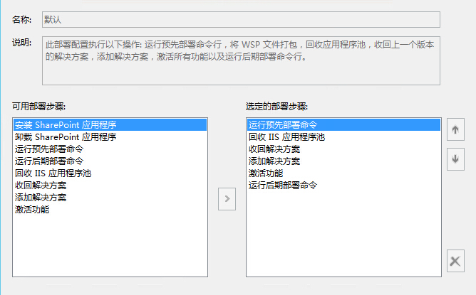

#VS部署SharePoint解决方案
	作者：柒月

在SharePoint项目开发过程中，我们常常使用VS的部署功能。那么，VS的部署过程中到底发生了什么？

###SharePoint部署配置
我们可以通过以下步骤查看SharePoint部署配置：右键SharePoint项目->属性->点击SharePoint Tab页->查看`默认`配置：

当然，我们也可以对此步骤进行自定义的修改：[如何编辑SharePoint部署配置](https://msdn.microsoft.com/en-us/library/ee231587.aspx)。
###查看输出窗口
使用VS部署时，通过输出窗口，对照上面的部署配置，我们可以看到做了哪些操作：

1. [运行预先部署命令](https://msdn.microsoft.com/en-us/library/ee231534.aspx)
2. 生成项目，打包项目
2. 回收IIS应用程序
3. 收回解决方案：[停用SPFeature](https://technet.microsoft.com/en-us/library/ff607879.aspx)，[卸载SPFeature](https://technet.microsoft.com/en-us/library/ff607614.aspx)，[卸载解决方案](https://technet.microsoft.com/zh-cn/library/ff607873.aspx)，[删除解决方案](https://technet.microsoft.com/zh-cn/library/ff607748.aspx)
4. 添加解决方案：[添加解决方案](https://technet.microsoft.com/zh-cn/library/ff607552.aspx)，[安装解决方案](https://technet.microsoft.com/zh-cn/library/ff607534.aspx)，[安装SPFeature](https://technet.microsoft.com/en-us/library/ff607825.aspx)
5. [激活SPFeature](https://technet.microsoft.com/en-us/library/ff607803.aspx)
6. [运行后期部署命令](https://msdn.microsoft.com/en-us/library/ee231534.aspx)
