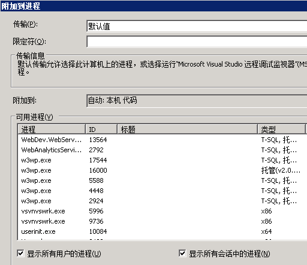
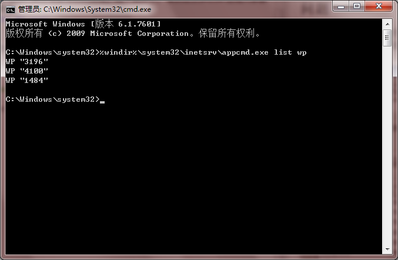

# 使用VS附加到进程的时候如何选择正确的W3WP进程?
	作者：jingnansu

## 问题
当我们在开发SharePoint项目的时候, 大家都会遇到一个问题; 在调试代码的时候, 总是不知道哪个W3WP进程才是我们真正需要调试的进程; 如下图所示, 看到这么多W3WP进程大家都懵了, 不知道选择哪个......

## 解决办法
其实我们可以用一段CMD命令来显示W3WP进程对应哪个SharePoint Web端口, 这样不就解决我们的"懵"了嘛.

脚本命令:
    %windir%\system32\inetsrv\appcmd.exe list wp

enjoy SharePoint
