# PowerShell介绍 第八回 数组
    作者：小敏

数组是一种数据结构，用于存储由相同类型的数据元素组成的集合。Windows PowerShell 支持的数据元素包括 string、int（32 位整数）、long（64 位整数）、bool（布尔）、byte 和其他 Microsoft .NET Framework 对象类型。

数组中既然可以存放各种不同类型的数据值。那么应该如何给数组赋值呢？在PowerShell中是使用逗号给数组赋值，啥也别说了，看例子吧。

##  ##定义一个数组

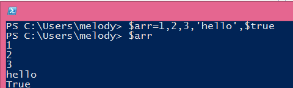
 
说明：在PowerShell中，声明一个变量为数组时，需要使用符号"@"，例如：

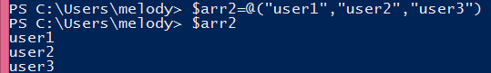

##  统计一个数组的成员数目

 
##  查看第一个数值，当然也可以一次取多个值
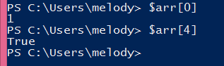
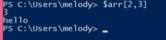
 
说明，在PowerShell中，数组元素的索引或要下标是从0开始的。
##可以给数组的成员单独赋值
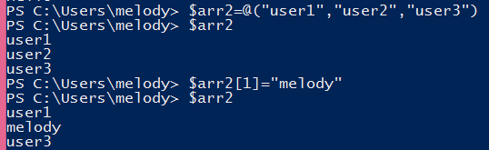 

##数组也是可以进行合并的
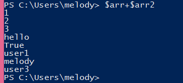
 
但是要注意合并的类型要相同，不然会报错
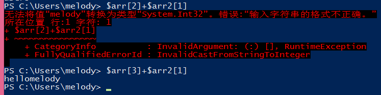
 
##创建连续数字数组的快捷方式

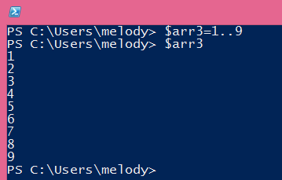
 
##数组合并
操作数组，可以更改数组中的元素、向数组添加元素以及将两个数组中的值组合成第三个数组
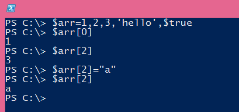
 
还可以使用数组的 SetValue 方法更改值，如下图：
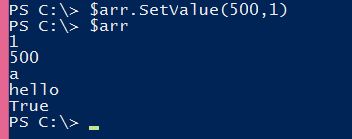
 
##删除数组
使用 Remove-Item cmdlet 删除包含该数组的变量
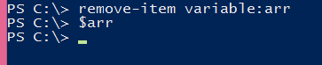
 
##实际的例子
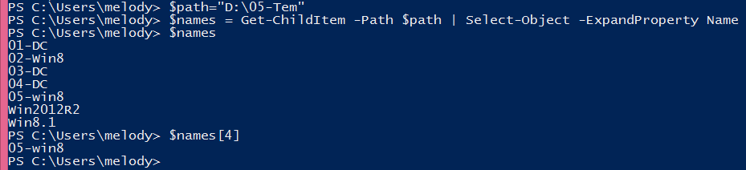
 
通过以上命令我们把结果存入到了names这个数组，当我们把一个命令的执行结果保存到一个变量中，可能会认为变量存放的是纯文本。那么怎么判断一个变量是否为数组？可以使用以下命令：
 
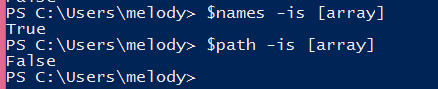

好了，今天的介绍就到这里。下次再见
