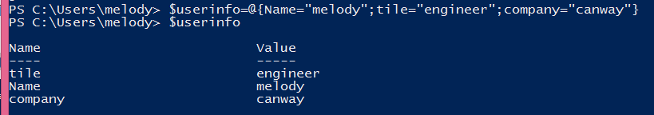
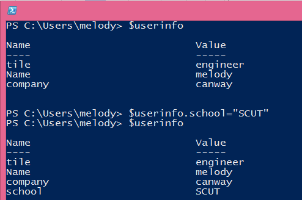
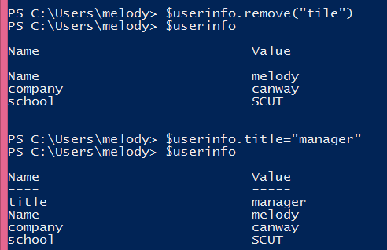
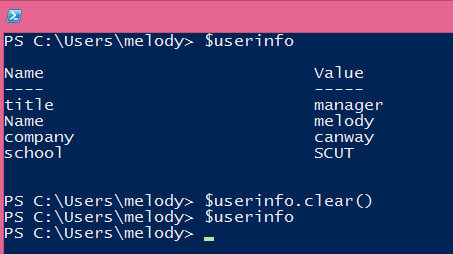

# PowerShell介绍 第九回 哈希表
    作者：小敏

聊完数组，接下来说说哈希值。其实这两者都是类似的：

1.	使用@()创建数组，而使用@{}创建哈希表

2.	同样地使用键访问对应的值。

 
那么，创建哈希表时，请遵循以下准则：
1. 以 at 符号 (@) 作为哈希表开头。

2. 用大括号 ({}) 将哈希表括起。

3. 输入一个或多个名称/值对作为哈希表的内容。

4. 使用等号 (=) 将每个名称与其值分隔开。

5. 使用分号 (;) 分隔名称/值对。

6. 如果名称或值包含空格，请将其用引号括起

接下来还是以比较简单的例子来介绍哈希值的用法，参考上面的操作，已经定义了一个哈希表，那么又该如何增删改呢？
##  在哈希表中插入新的键值

 
##更新数组名

例如，我的title写错了怎么办？直接更新即可。

 
 
##清理哈希表

 

同样的在清理之前你可以使用get-member来查看这个哈希表的方法和属性有哪些，其中就可以看到remove, clone,add,clear等等这些方法。

好了，今天的介绍就到这里。下次再见
