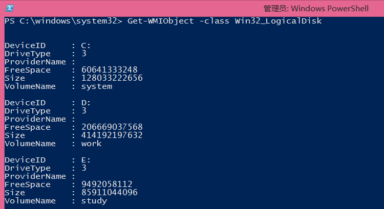

# PowerShell介绍 第十回 管道符
    作者：小敏

管道符，是在PowerShell脚本中很重要的一个角色，据说可以化腐朽为神奇。说不出什么长篇大论，简单的理解就是，用管道符号（|）连接一些命令，将上一个处理的结果，传送给下一个处理作为输入。由管道连接起来的命令从左到右依次执行，最后将结果输出到控制台或者存入某个数组或者哈希表。

## 语法 
Command-1 | Command-2 | Command-3

接下来还是通过例子来学习管道符的用法吧。或许看到这个例子你会觉得很平常，但是是否想过为什么这条命令会生效呢？是不是所有的操作都可以这么做呢？

简单地说，要使得 |能生效，那么|左边输出的结果类型要和|后面接受的类型相同，而且输出的内容也是后面可以匹配的。
那么，哪个参数接受管道符哪个参数不接受呢？如何才知道呢？

1.	使用get-help Compare-Object –full来查看这个命令更详细的用法，如果看到“是否接受管道输入”的值为false，那么就是不接受嘛

## 例子 

1.获取磁盘信息

2.查看可用空间

3.获取日志信息

4.补充常用的对管道结果进一步处理的命令

----------
Compare-Object: 比较两组对象。

ConvertTo-Html: 将 Microsoft .NET Framework 对象转换为可在 Web 浏览器中显示的 HTML。

Export-Clixml: 创建对象的基于 XML 的表示形式并将其存储在文件中。

Export-Csv: 将 Microsoft .NET Framework 对象转换为一系列以逗号分隔的、长度可变的 (CSV) 字符串，并将这些字符串保存到一个 CSV 文件中。

ForEach-Object: 针对每一组输入对象执行操作。

Format-List: 将输出的格式设置为属性列表，其中每个属性均各占一行显示。

Format-Table: 将输出的格式设置为表。

Format-Wide: 将对象的格式设置为只能显示每个对象的一个属性的宽表。

Get-Unique: 从排序列表返回唯一项目。

Group-Object: 指定的属性包含相同值的组对象。

Import-Clixml: 导入 CLIXML 文件，并在 Windows PowerShell 中创建相应的对象。

Measure-Object: 计算对象的数字属性以及字符串对象（如文本文件）中的字符数、单词数和行数。

more: 对结果分屏显示。

Out-File: 将输出发送到文件。

Out-Null: 删除输出，不将其发送到控制台。

Out-Printer: 将输出发送到打印机。

Out-String: 将对象作为一列字符串发送到主机。

Select-Object: 选择一个对象或一组对象的指定属性。它还可以从对象的数组中选择唯一对象，也可以从对象数组的开头或末尾选择指定个数的对象。

Sort-Object: 按属性值对象进行排序。

Tee-Object: 将命令输出保存在文件或变量中，并将其显示在控制台中。

Where-Object: 创建控制哪些对象沿着命令管道传递的筛选器。

好了，今天的介绍就到这里。下次再见
