# SharePoint 2016 IT Preview 初体验

    作者：杨柳@水杉网络

## 安装前提
* 硬件：虚拟机，4核CPU，8G内存，256G固态硬盘
* 操作系统：Windows Server 2012 R2 Standard
* 数据库：Sql Server 2012 Standard
* SharePoint：SharePoint 2016 IT Preview

## 安装
SharePoint 2016的安装和2013安装体验几乎一致，也是需要先运行安装前准备，然后运行安装包。

### 安装前准备
安装下载地址所描述，SharePoint 2016的安装前准备和2013一样，但实际上所需的组件还是有差别，主要体现在版本上，下面是2016安装前准备所需的组件：

* Application Server Role, Web Server (IIS) Role
* Microsoft SQL Server 2012 Native Client
* Microsoft ODBC Driver 11 for SQL Server
* Microsoft Sync Framework Runtime v1.0 SP1 (x64)
* Windows Server AppFabric
* Microsoft Identity Extensions
* Microsoft Information Protection and Control Client 2.1
* Microsoft WCF Data Services 5.6
* Microsoft .NET Framework 4.5.2
* Cumulative Update Package 1 for Microsoft AppFabric 1.1 for Windows Server (KB2671763)
* Visual C++ Redistributable Package for Visual Studio 2013
* Update for Microsoft .NET Framework to disable RC4 in Transport Layer Security (KB2898850)

整个安装过程完全等同2013，有图为证：

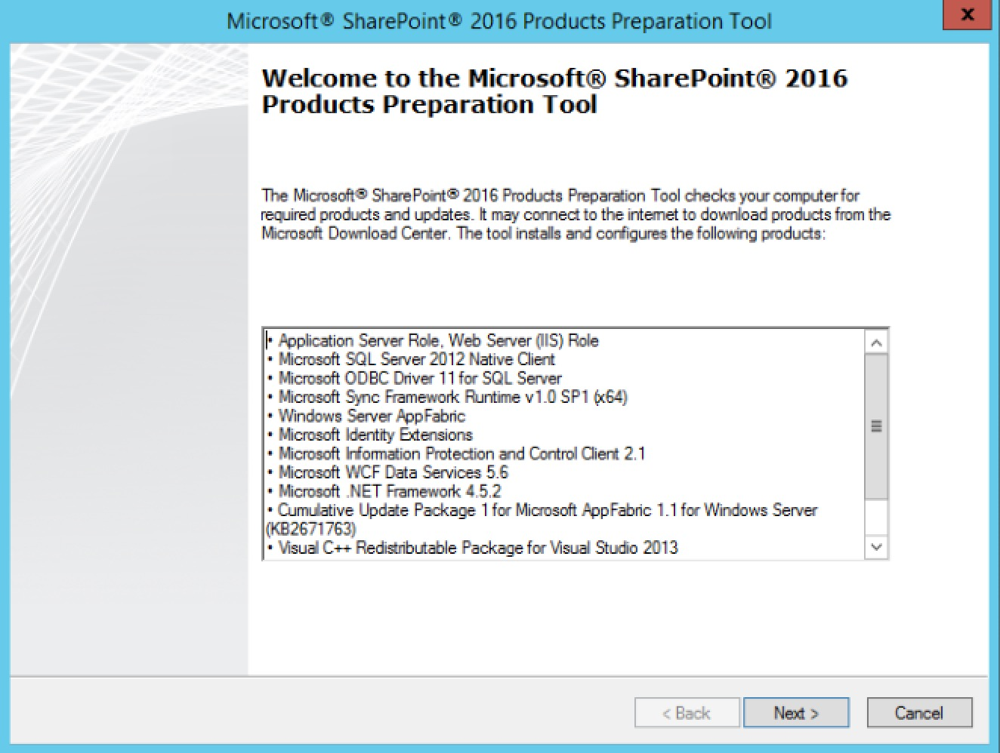

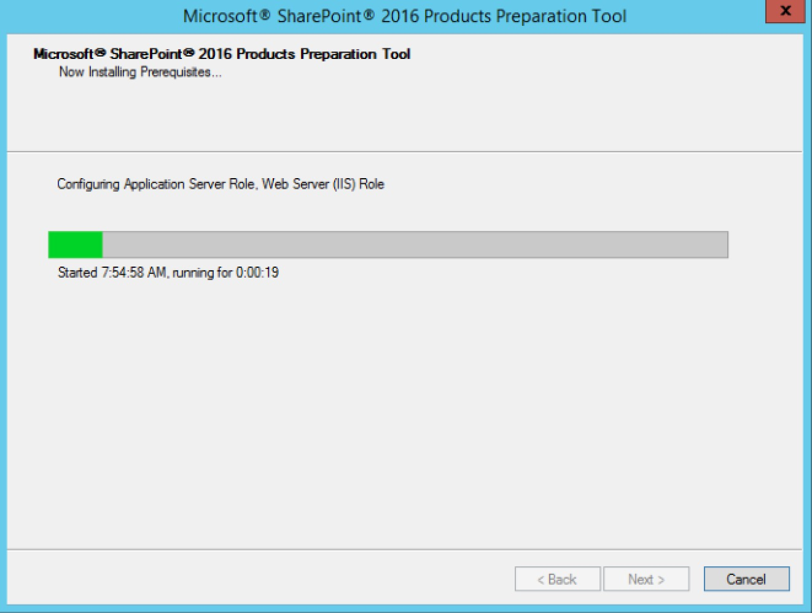

### 安装SharePoint 2016
在安全前准备完成后，接下来就可以正式安装SharePoint。整个SharePoint 2016的安装过程和2013类似，只是在服务器角色选择的界面上细化了服务器角色。

#### 首先是数据库配置，和2013保持一致

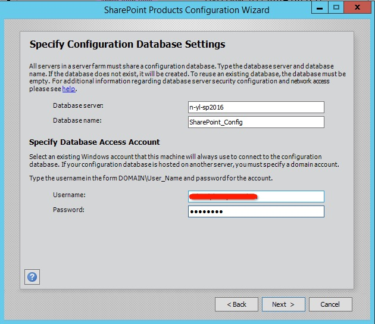

#### 通过之后就是服务器角色选择界面

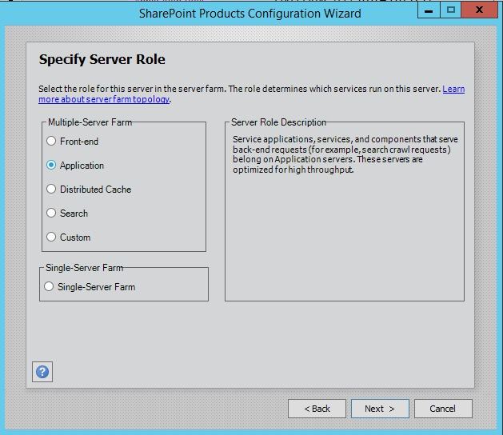
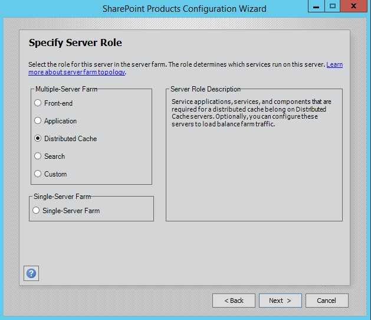
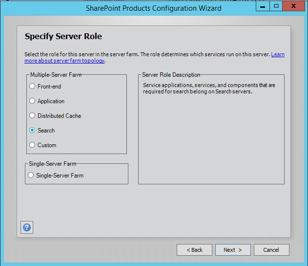
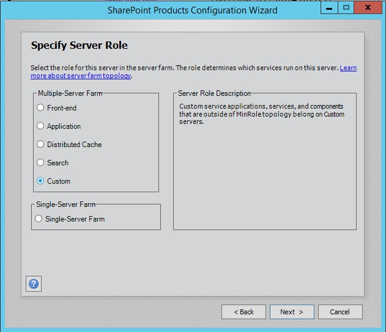
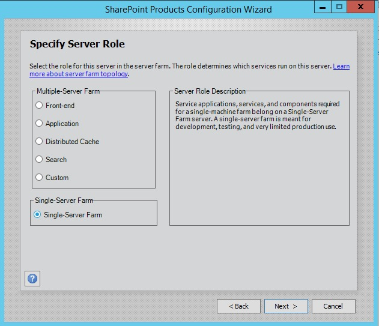

#### 这里我选择的Single-Server Farm用于测试

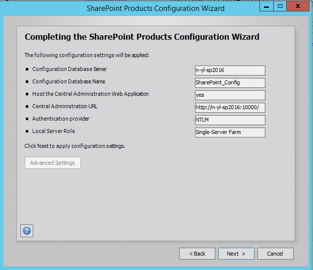

#### 配置成功后，和2013一样的信息画面

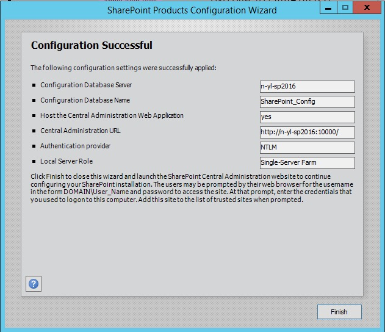

## 配置
在安装完成后，就可以进入SharePoint 2016的场配置界面了，粗略看了一下，和2013没有特别大的差别（除了服务和服务应用程序更多），所以熟悉SharePoint 2013的同学上手无压力。

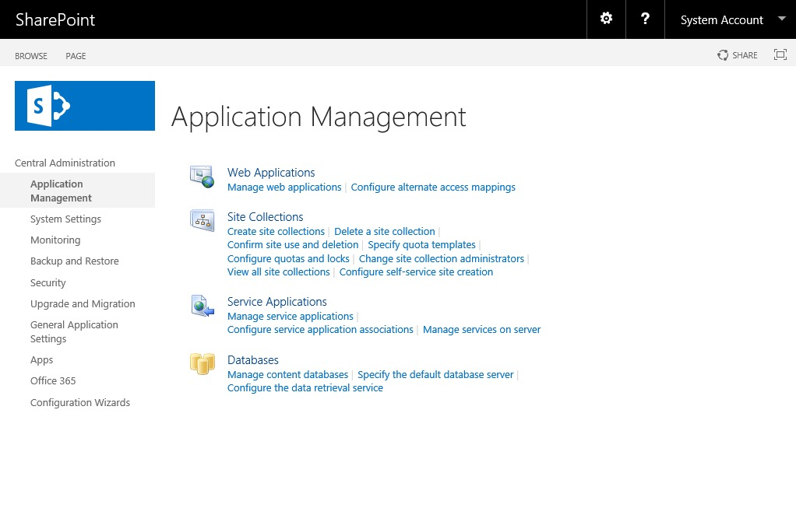

接下来创建一个Team Site看看：

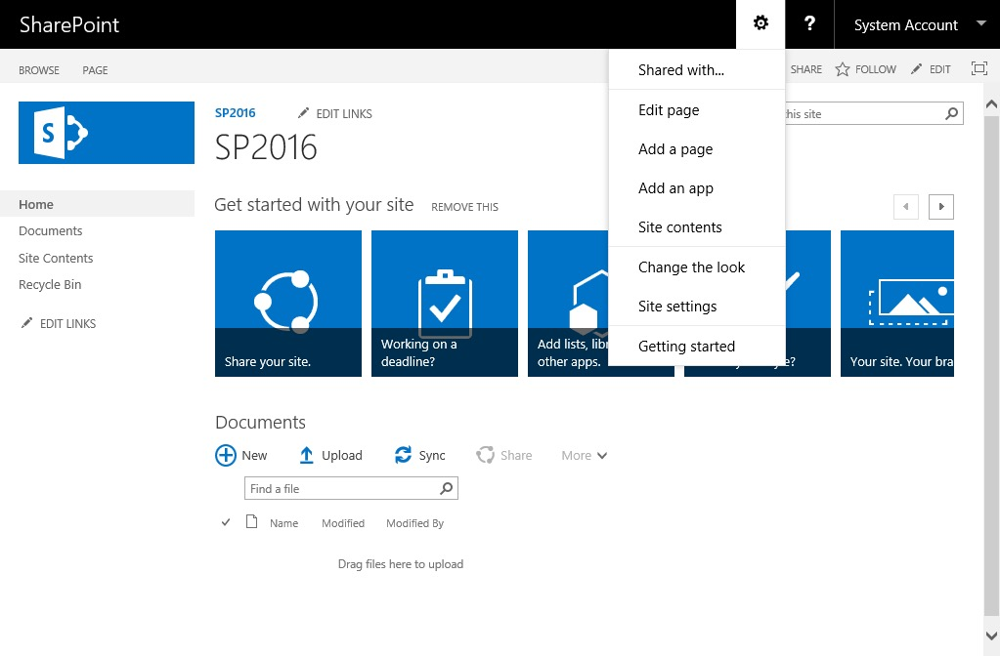

除了UI上的些许变化之外，和SharePoint 2013就是孪生兄弟。样子看上去差不多，那么功能上呢，是否对现有的SharePoint 2013的场解决方案天然支持？抱着这个目的我们继续往下。

## SharePoint 2013兼容测试

* 首先准备好以 SharePoint 2013为基础的场解决方案包，用Powershell部署：

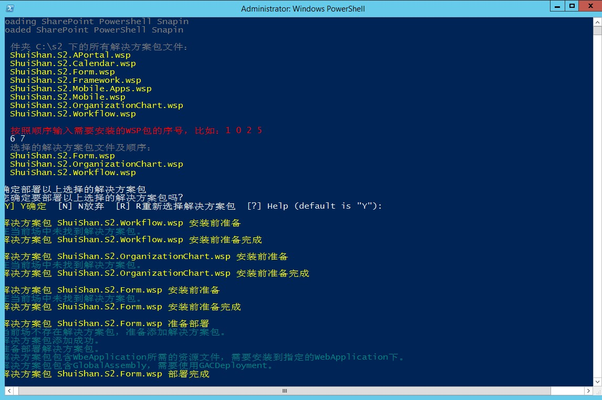

* 部署完成后查看网站管理的功能管理，功能全部激活：

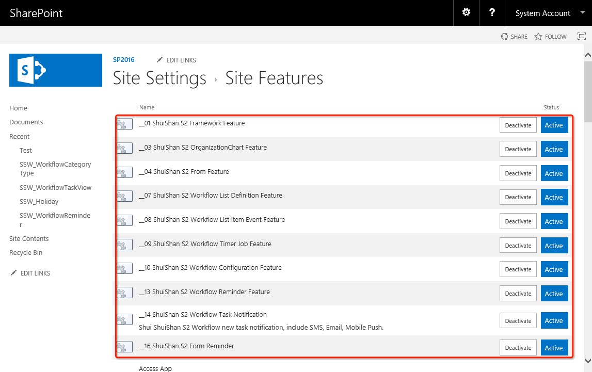

* 验证已有功能是否可以使用：

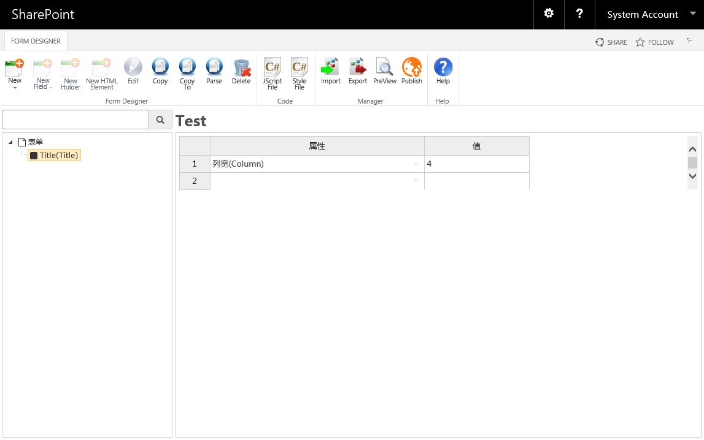

到目前为止，惊喜的发现SharePoint 2013的场解决方案可以在SharePoint 2016上跑起来，也算是码农福音。

## 后记

* 整个安装过程和SharePoint 2013类似，基本没有学习成本。
* 项目从2013迁移到2016应该不会有特别大的成本。
* 以目前的体验来看，2016在页面性能上比2013高出一大截。
* 目前预览版只放出了英文版本，另外可以下载日文和西班牙语语言包。
* 接下来会尝试一下开发上的体验，敬请期待。

