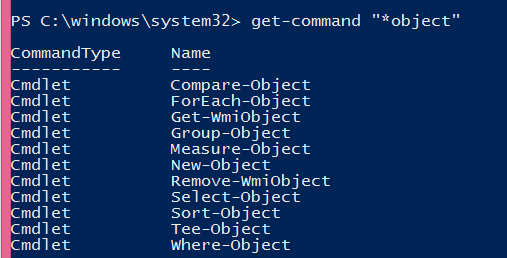
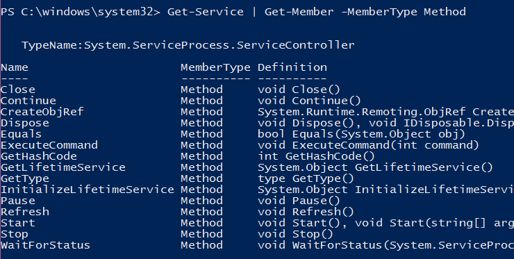
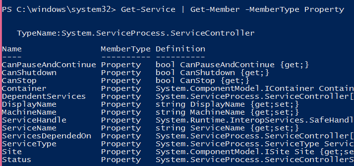
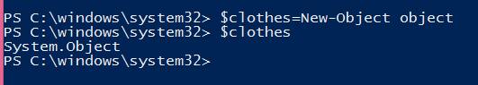
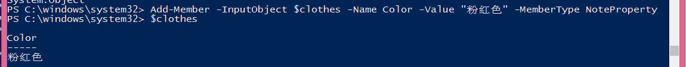
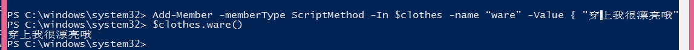
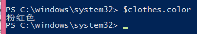

# PowerShell介绍 第十一回 对象
    作者：小敏
对象是什么呢？就是我们经常见到的object啊。一个object它有属性和方法，可以通过get-member来查看。

如果你只想看这个object的方法，则可以使用-MemberType Method。

方法，就是你可以对这个object做什么，例如下面的stop，start，我们可以停止和开启这个服务。

如果你只想看这个object的方法，则可以使用-MemberType Property。

属性，就是这个object具有的属性了，它的name啊，status啊等等。

就像一个杯子这个object，break就是它的方法，white就是它的属性（颜色的属性）

下面就简单再举个例子来说明object，property，method。

## 创建对象

通过New-Object可以创建一个对象（衣服），当前只是个空对象，还没属性也还没有方法。即这件衣服还没颜色也还不能穿不能洗。

## 添加属性

给这个对象添加属性，即给这个衣服添加颜色；

## 添加方法
给对象添加方法之后，然后就可以调用了不同的方法类型：

CodeMethod：映射到静态的.NET方法

Method：正常的方法

ScriptMethod：一个执行Powershell脚本的方法

## 查看属性

可以通过.的方式来查看属性，例如

好了，今天的介绍就到这里。下次再见
