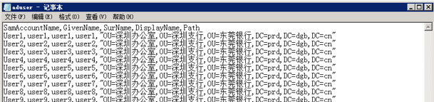

# PowerShell实战 第二回 管理AD用户对象
    作者：小敏

首先祝大家周末有空，昨天忘记发送推文了，罪过罪过。所以今天周末也必须补发！

## 批量创建AD用户

`Import-Csv C:\aduser.txt |foreach {New-ADUser -SamAccountName $_.samaccountname -Name $_. givenname -Surname $_.surname -DisplayName $_.displayname -Path $_.path -AccountPassword (ConvertTo-SecureString "1qaz@W SX" -AsPlainText -Force) -PassThru -Enabled $true}`

aduser.txt的内容如下截图：

## 列出某个OU的用户

`Get-ADUser –Filter * -Searchbase "OU=IT,DC=Contoso,DC=Com" | FT`

## 列出所有禁用的账号

`Search-ADAccount –AccountDisabled –Usersonly | FT Name`

## 列出某个组内用户然后移动到某个OU

`Get-ADGroupMember Agroup -Recursive | Move-ADObject  –TargetPath "OU=NewOU,DC=Contoso,DC=Com"`

## 移除某个OU个来自某个组的用户
`Get-ADGroupMember CSAdministrator | select Name, distinguishedName | Export-CSV CSAdministrator.csv -NoTypeInformation -Encoding UTF8`

## 将A组的用户移动到B组

`$Users = Get-ADUser -Filter * -Searchbase "OU=NewOU,DC=Contoso,DC=Com"
Remove-ADGroupMember -Identity People -Member $Users -Confirm:0
`

好了，今天的介绍就到这里。下次再见,再次祝大家周末愉快！
