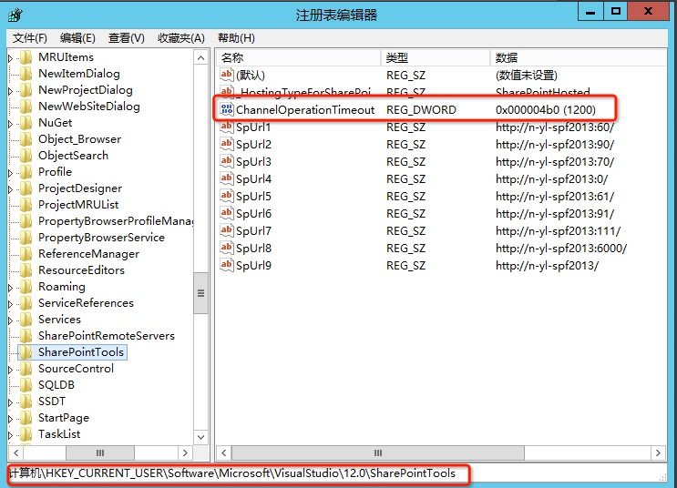

# VS 部署SharePoint解决方案超时解决方法

    作者：杨柳@水杉网络
    
## 问题

使用Visual Studio开发SharePoint解决方案，最常用的功能之一就是直接使用菜单上的部署菜单，将解决方案直接部署到开发环境进行预览或者测试。多数情况下使用这个功能都相安无事，但是，某些状况下，解决方案死活部署不上，多数情况都会出现在`激活功能`这一步。其中一种状况的错误提示是`部署步骤"激活功能"中出现错误: 在SharePoint宿主进程中调用命令时发生超时`。

## 原因

发生激活功能过程中的超时，一般由以下一个或者多个原因造成：

* 开发机器性能较低，导致部署过程漫长。
* 解决方案包中一个或者多个Feature包含过多的内容，比如过多的列表定义，过多的网站内容。
* Feature激活过程中存在自定义代码，导致激活过程漫长。

## 办法

Visual Stodio上的SharePoint开发工具实际上是一个独立的开发工具包，这个工具包也会包含各种特别的参数设置，其中一个参数叫做`ChannelOperationTimeout`， 官方解释是`指定 Visual Studio 等待 SharePoint 命令执行的时间（以秒为单位）。 如果命令未及时执行，则会引发 SharePointConnectionException。`，此值的默认值为120秒。因此可以根据实际需要调整。

此配置项位于注册表中，路径为`HKEY_CURRENT_USER\Software\Microsoft\VisualStudio\11.0\SharePointTools `。其中11.0的路径节点表示VS的版本号，比如使用VS 2013进行开发，那么就应该调整`HKEY_CURRENT_USER\Software\Microsoft\VisualStudio\12.0\SharePointTools `此路径下的配置项。

默认情况下注册表中不会存在此配置项，如果要修改为非默认值，需要手工添加一个名为`ChannelOperationTimeout`的`REG_DWORD`值，如下图：

